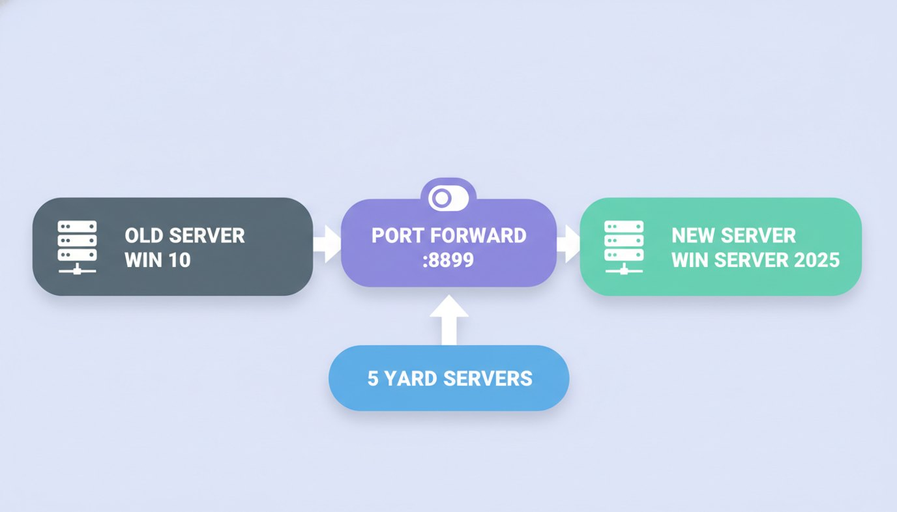
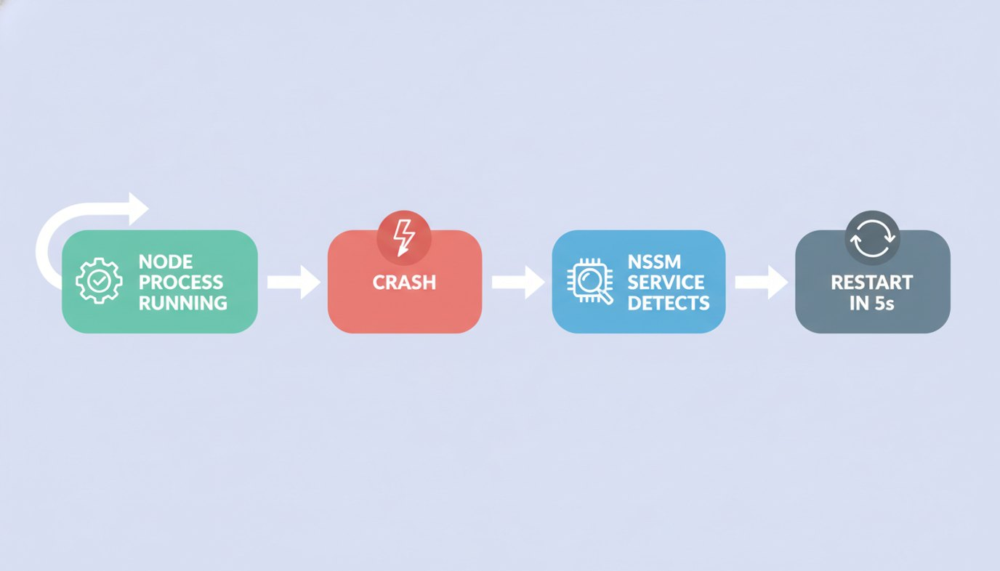

## 가장 안 어울리는 조합

AI 코딩 도구는 보통 "새 프로젝트를 빠르게 만든다"는 맥락에서 이야기된다. 깨끗한 Next.js, 잘 정리된 모노레포, 타입이 완벽한 코드베이스.

내가 맡은 건 정반대였다.

크레인 현장을 실시간으로 모니터링하는 산업용 시스템. Unity 2018 클라이언트, C++/MFC 서버, C# 통신 서버, 그리고 PLC에서 올라오는 데이터를 REST로 묶어주는 NestJS 게이트웨이. 버전 관리는 Git과 SVN이 섞여 있고, 빌드는 Visual Studio 2019에서만 돈다. 문서보다 오래된 코드가 많고, 코드보다 오래된 현장 장비가 더 많다.

그동안 게이트웨이는 윈도우 10 박스 한 대에서 오랫동안 테스트를 돌려왔다. 충분히 검증했으니, 이제 정식 운영 환경인 윈도우 서버 2025로 최종 전환하는 게 목적이었다. 다만 테스트 환경이다 보니 로그도 stdout으로 흘려보내 사라지고, 프로세스가 죽으면 아무도 모른 채 현장 데이터가 끊기는 상태였다 — 운영으로 가져가려면 그대로 둘 수는 없었다.

새 서버에서는 제대로 서비스로 등록하고, 로그를 남기고, 현장 데이터가 끊기지 않게 무중단으로 전환하는 것 — 그게 이번 작업의 목표였다.

## 내가 직접 하기 싫었던 이유

윈도우 서버 운영은 내 주력이 아니다. NSSM으로 노드 프로세스를 서비스 등록하고, 방화벽 인바운드를 열고, 포트포워딩을 갈아끼우고, 크래시 자동복구를 검증하는 일 — 할 수는 있지만, 한 단계마다 검색하고 확인하느라 반나절은 날아간다.

그래서 이번엔 처음부터 에이전트에게 SSH 세션을 맡겨봤다. 나는 방향을 잡고, 실제 명령은 에이전트가 친다.

결론부터 말하면 옮기는 데 성공했다. 다만 "AI가 알아서 다 해줬다"는 식의 이야기는 아니다. **비대화형 SSH로 윈도우 서버를 다루는 건, 에이전트에게도 지뢰밭이었다.**

## 실패한 접근법들 — 여기서 배운 게 더 많다

이전 작업의 가치는 성공한 명령어 목록이 아니라, **막힌 지점들**에 있었다. 그대로 옮겨 적는다.

**1. 인라인 PowerShell은 깨진다**

SSH로 긴 PowerShell 한 줄을 그대로 던지면, 따옴표와 해시테이블(`@{n=...;e={...}}`)이 이스케이프 과정에서 박살난다. 파싱 에러가 나는데 원인은 내 코드가 아니라 전송 계층이다.

> 교훈: 복잡한 스크립트는 `.ps1` 파일로 작성해서 `scp`로 보낸 뒤 `powershell -ExecutionPolicy Bypass -File`로 실행한다. 인라인은 한 줄짜리 단순 명령에만.

**2. `Start-Process node`로 띄운 프로세스는 즉시 죽는다**

`Start-Process node -RedirectStandardOutput ...` 방식은 SSH 세션이 끊기는 순간 같이 죽었다. 백그라운드 데몬처럼 보이지만 아니었다.

> 교훈: 노드 서버를 상시 가동하려면 **NSSM 서비스**로 등록한다. `AppExit Restart` + `AppRestartDelay 5000`을 걸면 프로세스를 강제로 kill해도 5초 안에 NSSM이 되살린다. 이걸 실제로 kill해보며 검증했다.

**3. private repo clone에서 인증 프롬프트가 막는다**

비대화형 SSH 안에서 `git clone`을 하면 credential manager가 인증창을 띄우려다 그냥 멈춘다. 사람이 없으니 영영 안 끝난다.

> 교훈: 맥에서 `gh auth token`으로 토큰을 뽑아 `https://x-access-token:<TOKEN>@github.com/...` 형태의 임시 URL로 clone하고, **직후에 `git remote set-url`로 토큰을 즉시 제거**한다. 토큰이 remote에 박힌 채 남지 않도록.

**4. 컷오버 중엔 "어느 박스에 붙은 건지" 헷갈린다**

외부 포트로 health를 확인할 때, 두 서버가 잠깐 동시에 떠 있으면 응답이 어느 박스에서 온 건지 알 수 없다. uptime으로 구분하려 했지만 위험했다.

> 교훈: 외부 URL과 `localhost`를 **항상 대조**한다. 그리고 컷오버가 끝나면 구 서버의 스케줄 태스크를 명시적으로 Disabled 처리해서 중복 세션 자체를 없앤다.

## 에이전트와 인프라 작업을 할 때의 진짜 노하우

세부 명령보다 중요한 건 작업을 구조화하는 방식이었다.

- **설치는 winget으로 일괄 처리.** 윈도우 서버 2025는 winget이 기본 제공된다. 단, 비대화형이라 `--silent --disable-interactivity`가 필수다. 이걸 빼면 설치가 프롬프트에서 멈춘다.
- **cleanup 단계는 에러를 무시하게 짠다.** `$ErrorActionPreference='Stop'` 상태에서 존재하지 않는 서비스에 `nssm stop`을 걸면 스크립트 전체가 중단된다. 정리 단계는 "있으면 지우고 없으면 넘어가게" 방어적으로.
- **로그를 가장 먼저 살린다.** 기존 서버의 가장 큰 문제는 stdout이 사라지는 거였다. NSSM에 10MB 로그 회전을 걸어 `gateway.log`와 `.err`을 남기는 것부터 했다. 이후 모든 검증이 이 로그 위에서 이뤄졌다.

## HANDOFF 한 장으로 세션을 이었다

이 작업은 하루에 끝나지 않았다. 그리고 에이전트는 세션이 바뀌면 기억하지 못한다.

그래서 `HANDOFF.md`를 한 장 만들었다. 목표, 서버 정보, 완료한 체크리스트, **성공한 접근법**, **실패한 접근법(반복 금지)**, 다음 단계. 새 세션에 이 파일 경로 하나만 주면 곧장 이어서 작업했다.

이게 핵심이었다. AI에게 인프라를 맡길 때, 컨텍스트는 대화에 두면 안 된다. **검증된 사실과 금지된 삽질을 문서로 외부화**해야 다음 세션이, 그리고 다음의 내가, 같은 함정에 다시 빠지지 않는다.

## 무엇이 바뀌었나

크래시가 나도 5초 안에 살아나는 서버, 흘러가 사라지지 않는 로그, 그리고 같은 작업을 다시 할 때 펼쳐볼 한 장의 문서.

레거시 산업 시스템은 "AI로 새로 만들기" 같은 깔끔한 데모와 거리가 멀다. 하지만 바로 그래서, 검색과 확인으로 반나절씩 까먹던 반복 작업을 에이전트에게 넘기고 내가 판단에만 집중할 수 있었던 경험은 더 선명하게 남았다.

코드를 새로 쓰는 것보다, **이미 돌아가는 걸 안 죽이면서 옮기는 일**이 훨씬 어렵다. 그리고 그 어려운 일에서 AI 에이전트는 생각보다 쓸 만했다 — 함정을 문서로 정리해주는 사람만 옆에 있다면.
