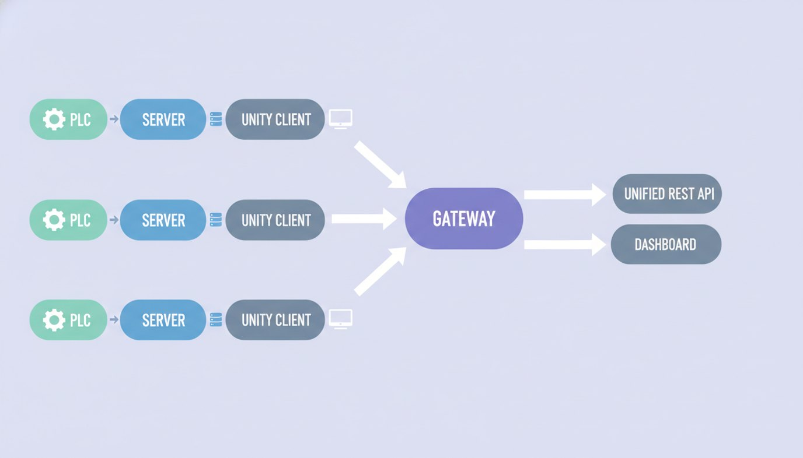
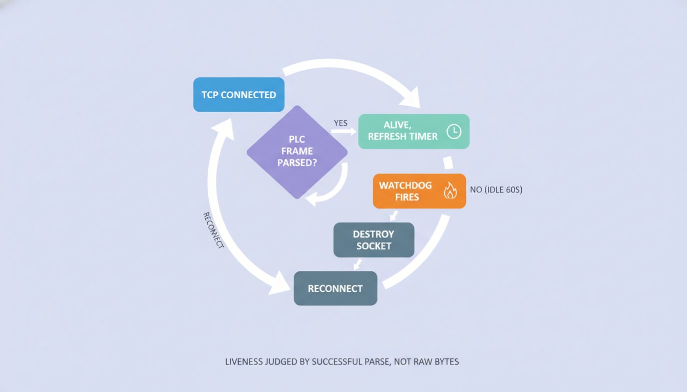

## 데이터는 있는데, 꺼낼 수가 없었다

조선소에는 구역(야드)마다 크레인 실시간 모니터링 시스템이 **따로** 돌아가고 있었다. 10년쯤 묵은 물건이다. 구역별로, C++/MFC로 짠 비전 처리 서버가 지멘스 PLC에서 크레인 상태를 읽어오고, C# 중계 서버를 거쳐, Unity로 만든 데스크톱 클라이언트가 3D로 그려준다. 각 구역만 놓고 보면 현장에서 잘 돌아갔다.

그러던 어느 날 고객사에서 요청이 들어왔다. **구역마다 따로 돌아가는 이 모니터링을 하나로 통합하고 싶다**는 거였다. 구역별로 흩어진 크레인 상태를 한곳에서 보려면, 결국 모든 구역의 데이터를 모아주는 **공통 API**가 필요했다. 그런데 그 데이터는 구역마다 **Unity 클라이언트 안에만** 갇혀 있었다. 꺼내올 통로가 없었다. REST API 같은 건 당연히 없었다.

그렇다고 PLC에서 바로 읽자니, 그 데이터가 어떤 포맷으로 흘러다니는지 아무도 정리해 둔 게 없었다. 프로토콜 명세서? 없다. 아는 사람? 퇴사했거나, 어렴풋이 기억할 뿐이다.

그래서 만들기로 한 게 게이트웨이였다. **구역마다 떠 있는 기존 서버에 각각 클라이언트로 접속해서, 흩어진 데이터를 한데 모아 REST API 하나로 다시 뱉어주는 중계 서버.** 이게 있으면 고객사는 그 위에 통합 대시보드든 외부 연동이든 마음대로 붙일 수 있다. 문제는 "흘러오는 데이터"의 정체를 아무도 모른다는 것뿐이었다.



## 명세서가 없으면, 코드가 명세서다

다행히 옛 코드는 남아 있었다. Unity 클라이언트의 `TCPClient.cs`, 그리고 서버 쪽 C# 소스 — `GlobalData.cs`, `PrivateCraneInfo.cs`, `CraneFullInfoBar.cs`, `YardMgr.cs`. 사람이 읽기엔 지옥 같은, 주석도 거의 없는 레거시 덩어리였다.

여기서 AI 에이전트의 진가가 나왔다. 나는 이 소스들을 통째로 던지고 물었다.

> "이 클라이언트가 서버랑 어떻게 통신하는지, 와이어 포맷 수준으로 정리해줘."

며칠에 걸쳐 가설을 세우고, 코드를 교차 대조하고, 의심스러운 부분을 다시 읽으며 — 결국 프로토콜 전체를 문서로 복원했다. 핵심은 이랬다.

- 채널이 **두 개**다. 포트 9911은 명령 채널(요청/응답), 9913은 데이터 채널(실시간 스트리밍).
- 접속하면 서버가 `CONN_ID`를 내려준다. 그걸 받아 `REQ_PLCDATA,<connId>,ON`을 보내야 비로소 데이터가 흐른다.
- 연결을 유지하려면 주기적으로 `ALIVE,<connId>`를 양쪽 소켓에 쏴줘야 한다.
- 데이터는 콤마로 구분된 CSV. 각 배치는 개행(`\n`)으로 끝난다. 중간중간 `ACK`나 `CONN_ID` 같은 제어 메시지가 개행 없이 끼어든다.

이 한 장의 분석 문서가, 사실상 게이트웨이 전체 설계의 출발점이 됐다.

## 크레인 한 대 = 101개 필드

진짜 까다로운 건 데이터 본문이었다. 크레인 한 대의 상태가 **콤마로 구분된 101개 필드**로 날아온다. 어디가 위치이고, 어디가 하중이고, 어디가 충돌 방지 거리인지 — 라벨 같은 건 없다. 그냥 숫자의 행렬이다.

이걸 알아내는 방법도 똑같았다. 옛 C# 소스에서 "이 인덱스를 이렇게 읽더라"를 하나하나 추출하는 것. 그렇게 만든 게 필드 오프셋 상수 테이블이다.

```ts
export const IPADD_COUNT = 101; // 크레인당 필드 수
export const PLC_SCALE = 0.1;   // raw 정수 → 실제 단위(m, deg, ton)

export const FIELD = {
  SYSTEM_FAULT: 1,
  CRANE_ON: 2,
  MOTION_START: 9,      // up/down 쌍 × 6축
  AC_GANTRY_NO: 88,     // DBW024 - 충돌 감지 크레인 번호
  AC_GANTRY_DIST: 89,   // DBW026 - 충돌 거리
  PLC_DATETIME_START: 82,
  TOTAL_LOAD: 90,
  POSITION_START: 91,   // hoist/trolley/gantry 6축 위치
};
```

각 상수 옆 주석에 `GlobalData.cs:176-195`, `CraneFullInfoBar.cs:406` 같은 출처가 박혀 있다. AI가 역공학하면서 "내가 이 숫자를 어디서 가져왔는지" 근거를 남겨둔 것이다. 나중에 값이 이상할 때 이 출처를 따라가면 바로 검증할 수 있었다.

그리고 야드마다 포맷이 미묘하게 달랐다. 어떤 야드는 크레인 블록 사이에 빈 더미 필드를 끼워 넣고, 어떤 야드는 크레인 ID를 1000번대로 쓴다. 그래서 파서는 단순히 101개씩 끊지 않고, 항상 `ID_` 마커를 기준으로 다시 정렬한다.

```ts
// 앞쪽 쓰레기 필드를 건너뛰고 ID_ 마커를 찾을 때까지 전진
while (!(fields[base] || '').trim().startsWith('ID_')) {
  base++;
}
```

이런 "현장에서만 드러나는 예외"들은, 실제 데이터를 받아보며 하나씩 메워나갔다.

## 진짜 어려운 건 파싱이 아니라 연결이었다

파서는 사실 금방 안정됐다. 시간을 가장 많이 잡아먹은 건 **TCP 연결을 어떻게 죽지 않게 유지하느냐**였다.

산업 현장의 네트워크는 깨끗하지 않다. 상대 서버가 크래시하거나, RST 패킷이 유실되면, 소켓은 `close` 이벤트도 없이 "연결됨" 상태로 영원히 좀비가 된다. 데이터는 안 오는데, 코드 입장에선 멀쩡히 살아 있는 것처럼 보인다. 그러면 대시보드는 옛날 값을 계속 보여준다 — 가장 위험한 종류의 버그다.

처음엔 "바이트가 들어오면 살아있는 것"으로 판정했다. 그런데 어떤 야드에서, 파싱도 안 되는 쓰레기 바이트만 계속 흘려보내는 상황이 터졌다. 코드 주석에 그날이 박제돼 있다.

```ts
// 좀비 TCP(프로세스 크래시 / RST 유실)는 'close' 이벤트 없이
// 영원히 "연결됨"으로 남고, 비정상 peer는 파싱 안 되는 바이트만
// 계속 흘릴 수 있다 — 두 경우 모두 캐시가 stale 해진다.
// 파싱 가능한 크레인 배치만 lastParsedAt 을 갱신한다.
// (2026-04-20 1DOCK 사건 참조)
```

그래서 살아있음의 기준을 **"바이트 수신"에서 "PLC 프레임 파싱 성공"으로** 바꿨다. 워치독이 15초마다 돌면서, 마지막으로 *제대로 파싱된* 시각이 60초를 넘으면 소켓을 강제로 끊고 새로 연결한다.



여기에 몇 가지를 더 얹었다.

- **지수 백오프 재연결**: 끊길 때마다 간격을 2배씩, 최대 30초까지.
- **idle-reconnect 에스컬레이션**: 연결은 되는데 데이터가 안 들어와 워치독만 반복해서 도는 상황을 카운트하고, 5회 연속이면 에러 로그를 띄운다(단, 5분 쿨다운으로 로그 폭주 방지).
- **TCP keepalive + 애플리케이션 레벨 ALIVE** 이중화.

이런 건 한 번에 떠올린 게 아니다. 운영하면서 터지는 사건마다 가설을 세우고, 코드에 방어막을 한 겹씩 덧댄 결과다. AI는 매번 "이 증상이면 원인은 이거고, 이렇게 막자"는 후보를 빠르게 제시해줬고, 나는 그게 말이 되는지 판단했다.

## 내가 한 일, AI가 한 일

이 프로젝트에서 역할 분담은 꽤 선명했다.

**AI가 한 일**은 노동집약적이고 반복적인 영역이었다. 수천 줄 레거시 C# 읽기, 필드 인덱스 교차 대조, NestJS 보일러플레이트(모듈/서비스/컨트롤러) 생성, Swagger 데코레이터 작성, 그리고 — 캡처한 실제 프레임을 넣고 파서 동작을 검증하는 **테스트 작성**. 파서, freshness 판정, 존 연결 로직마다 spec 파일이 붙었다. 사람이 직접 했으면 지쳐서 안 했을 일이다.

**내가 한 일**은 방향과 검증이었다. "이중 채널이 맞나?", "이 값이 미터가 아니라 0.1 스케일 아닌가?", "이 재연결 전략이 현장에서 버틸까?" — 도메인 판단과, 실제 현장 데이터로 맞는지 대조하는 것. AI가 빠르게 만든 가설을, 현실에 비춰 깎아내는 역할.

결과물은 이렇게 정리됐다.

- 야드 5개 구역의 PLC 데이터를 TCP로 받아 약 0.5초 주기로 갱신
- 크레인 실시간 상태 / 설치 좌표 / 장애물 정보를 깔끔한 REST API로 제공
- Swagger 자동 문서화 + 실시간 모니터링 대시보드
- 파서·연결·캐시 전 구간 단위 테스트

그리고 이 게이트웨이는 한 달쯤 뒤, 테스트 서버에서 새 운영 서버로 **무중단으로 옮겨져 프로덕션에 올라갔다.** 그 이야기는 [다른 글](/posts/ai-agent-legacy-server-migration)에 따로 적었다.

## 레거시일수록, AI 역공학이 강하다

새 프로젝트를 AI로 빠르게 찍어내는 이야기는 많다. 그런데 내가 이번에 체감한 건 정반대 방향이었다.

**문서가 없고, 아무도 기억 못 하고, 코드만 덩그러니 남은 레거시** — 거기서 AI가 가장 강했다. 사람이 견디기 힘든 건 창의적인 부분이 아니라, 수천 줄을 끈질기게 대조하며 "이 숫자가 저 숫자랑 같은가"를 확인하는 단순 반복이다. AI는 그걸 지치지 않고 한다.

10년 묵은 시스템에 REST API를 입히는 일은, 예전 같으면 "그 코드 아는 사람 찾기"부터 막혔을 거다. 이번엔 그 사람이 AI였다. 명세서가 없으면 코드가 명세서이고, 그 코드를 읽어내는 일은 이제 혼자서도 충분히 할 수 있는 일이 됐다.
