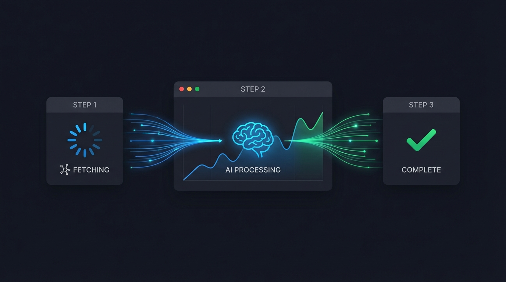

## 프로젝트 개요

**프로젝트**: AI Scraper (웹 데이터 수집 자동화)  
**개발 기간**: 2025.02 (약 1주)  
**기술 스택**: Next.js, TypeScript, AI API, Supabase  
**주요 작업**: 8 commits

---

## 왜 만들었나

회사에서 경쟁사 가격 모니터링이 필요했다. 수작업으로 하자니 시간이 너무 걸리고, 기존 스크래핑 도구는 설정이 복잡했다.

**원하는 것:**
- URL만 입력하면 원하는 데이터 추출
- 코딩 없이 자연어로 "가격 정보 가져와" 같은 명령
- 정기적으로 자동 실행

AI를 붙이면 되겠다 싶었다.

---


## 구현 과정

### 기본 구조 설계

```bash
49d63de8 2025-02-17 feat: AI 스크래퍼 서비스 구현
```

기본 아이디어:

1. 사용자가 URL과 추출 명령 입력
2. 웹페이지 HTML 가져오기
3. AI에게 HTML + 명령 전달
4. AI가 구조화된 데이터 반환

```typescript
async function scrape(url: string, instruction: string) {
  // 1. HTML 가져오기
  const html = await fetchPage(url);
  
  // 2. AI에게 전달
  const prompt = `
    다음 HTML에서 "${instruction}"에 해당하는 데이터를 JSON으로 추출해줘.
    
    HTML:
    ${html}
  `;
  
  // 3. AI 응답
  const result = await callAI(prompt);
  
  return JSON.parse(result);
}
```

### 타입 에러 수정

```bash
7605bba7 2025-02-17 fix: 타입스크립트 에러 수정
d27b8052 2025-02-17 Merge branch 'fix/typescript-errors' into feature/ai-scraper
```

AI 응답은 항상 문자열이라 타입 처리가 까다로웠다.

```typescript
interface ScrapedData {
  [key: string]: unknown;
}

function parseAIResponse(response: string): ScrapedData {
  try {
    // JSON 블록만 추출
    const jsonMatch = response.match(/```json\n?([\s\S]*?)\n?```/);
    if (jsonMatch) {
      return JSON.parse(jsonMatch[1]);
    }
    return JSON.parse(response);
  } catch {
    throw new Error('AI 응답 파싱 실패');
  }
}
```

---

## AI 스크래퍼 기능 개선

```bash
a7286378 2025-02-21 feat(ai-scraper): AI 스크래퍼 기능 개선
e0694bba 2025-02-21 style(ai-scraper): 제목 텍스트 색상을 흰색으로 변경
```

### HTML 전처리

웹페이지 전체 HTML을 AI에게 보내면 토큰 낭비다. 필요한 부분만 추출:

```typescript
function preprocessHTML(html: string): string {
  // script, style 태그 제거
  let cleaned = html.replace(/<script[\s\S]*?<\/script>/gi, '');
  cleaned = cleaned.replace(/<style[\s\S]*?<\/style>/gi, '');
  
  // 주석 제거
  cleaned = cleaned.replace(/<!--[\s\S]*?-->/g, '');
  
  // 불필요한 속성 제거
  cleaned = cleaned.replace(/\s(class|id|style|data-[\w-]+)="[^"]*"/g, '');
  
  return cleaned;
}
```

이렇게 하면 HTML 크기가 1/10 정도로 줄어든다.

### 구조화된 프롬프트

```typescript
const systemPrompt = `
당신은 웹 데이터 추출 전문가입니다.
주어진 HTML에서 요청된 정보를 정확히 추출하세요.

규칙:
1. 반드시 JSON 형식으로 응답
2. 찾을 수 없는 정보는 null로 표시
3. 배열 데이터는 모든 항목 추출
4. 가격은 숫자만 추출 (통화 기호 제외)
`;

const userPrompt = `
URL: ${url}
요청: ${instruction}

HTML:
${preprocessedHTML}
`;
```

---



## 실시간 UI 업데이트

스크래핑은 시간이 걸린다. 사용자에게 진행 상황을 보여줘야 했다.

```typescript
// 서버: Server-Sent Events로 진행 상황 전송
export async function POST(req: Request) {
  const encoder = new TextEncoder();
  
  const stream = new ReadableStream({
    async start(controller) {
      // 1단계: HTML 가져오기
      controller.enqueue(encoder.encode('data: {"step": "fetching"}\n\n'));
      const html = await fetchPage(url);
      
      // 2단계: AI 처리
      controller.enqueue(encoder.encode('data: {"step": "processing"}\n\n'));
      const result = await callAI(html, instruction);
      
      // 3단계: 완료
      controller.enqueue(encoder.encode(`data: {"step": "done", "result": ${JSON.stringify(result)}}\n\n`));
      controller.close();
    }
  });
  
  return new Response(stream, {
    headers: { 'Content-Type': 'text/event-stream' }
  });
}
```

```typescript
// 클라이언트: EventSource로 수신
function useScraper() {
  const [status, setStatus] = useState('idle');
  const [result, setResult] = useState(null);
  
  const scrape = async (url: string, instruction: string) => {
    const eventSource = new EventSource(`/api/scrape?url=${url}&q=${instruction}`);
    
    eventSource.onmessage = (event) => {
      const data = JSON.parse(event.data);
      setStatus(data.step);
      
      if (data.step === 'done') {
        setResult(data.result);
        eventSource.close();
      }
    };
  };
  
  return { status, result, scrape };
}
```

---

## 상태 관리 개선

```bash
26bc935d 2025-02-19 fix: botList 상태 변경 감지 개선
```

스크래핑 결과를 저장하고 다시 불러오는 기능도 필요했다.

```typescript
// 저장된 스크래핑 작업 목록
const [jobs, setJobs] = useState<ScrapingJob[]>([]);

// 새 작업 추가 시 즉시 반영
const addJob = (job: ScrapingJob) => {
  setJobs(prev => [...prev, job]);
};

// Supabase에서 실시간 동기화
useEffect(() => {
  const subscription = supabase
    .channel('scraping_jobs')
    .on('INSERT', (payload) => {
      addJob(payload.new as ScrapingJob);
    })
    .subscribe();
    
  return () => subscription.unsubscribe();
}, []);
```

---

## 배운 점

### 1. AI의 한계 인식

AI가 HTML을 완벽하게 파싱하진 못한다. 특히:
- 동적으로 로드되는 콘텐츠 (JavaScript 렌더링)
- iframe 내부 콘텐츠
- 복잡한 테이블 구조

이런 경우는 브라우저 자동화(Puppeteer)가 필요하다.

### 2. 토큰 비용 관리

HTML 전체를 보내면 토큰 비용이 폭발한다. 전처리로 필요한 부분만 추출하는 게 중요하다.

### 3. 에러 핸들링

스크래핑은 실패할 확률이 높다:
- 사이트가 봇을 차단
- HTML 구조 변경
- 네트워크 타임아웃

모든 단계에서 적절한 에러 처리와 재시도 로직이 필요하다.

```typescript
async function fetchWithRetry(url: string, retries = 3): Promise<string> {
  for (let i = 0; i < retries; i++) {
    try {
      const res = await fetch(url, {
        headers: {
          'User-Agent': 'Mozilla/5.0 ...'  // 봇 차단 우회
        }
      });
      return await res.text();
    } catch (e) {
      if (i === retries - 1) throw e;
      await sleep(1000 * (i + 1));  // 점진적 대기
    }
  }
  throw new Error('Unreachable');
}
```

---

## 마무리

1주일 만에 기본적인 AI 스크래퍼를 만들었다.

코딩 없이 자연어로 데이터를 추출한다는 컨셉은 성공적이었다. 다만 복잡한 사이트나 동적 콘텐츠는 여전히 한계가 있다.

다음 버전에서는 Puppeteer를 연동해서 JavaScript 렌더링까지 지원할 계획이다.

---

*스크래핑은 법적 이슈가 있을 수 있다. robots.txt와 이용약관을 확인하자.*
