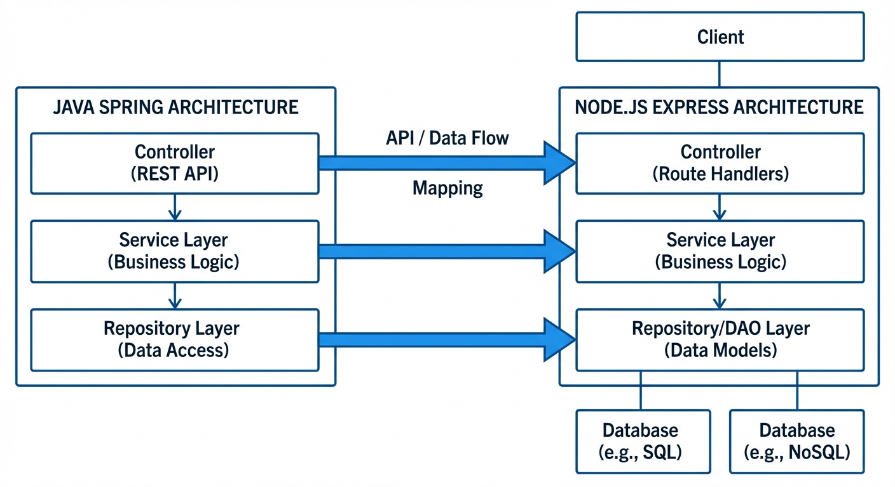
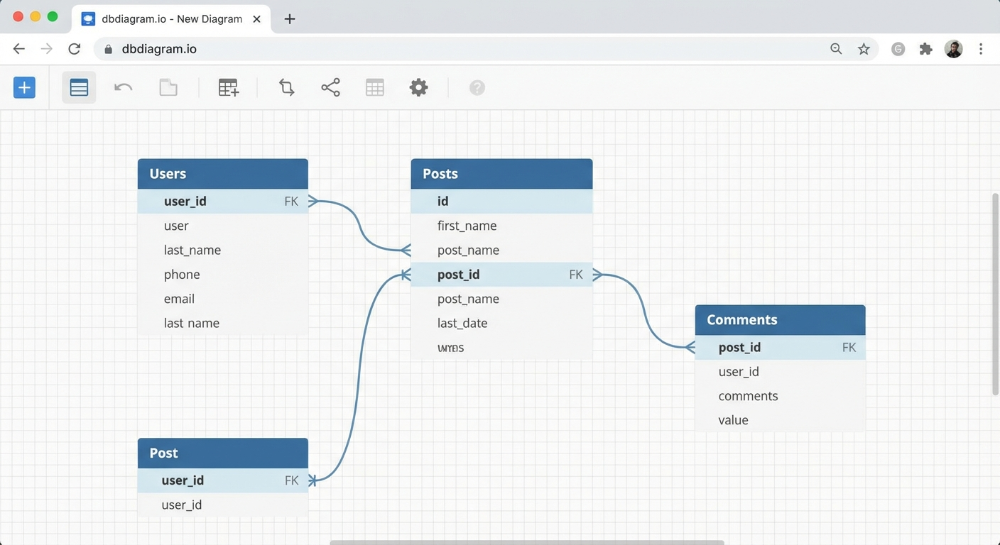
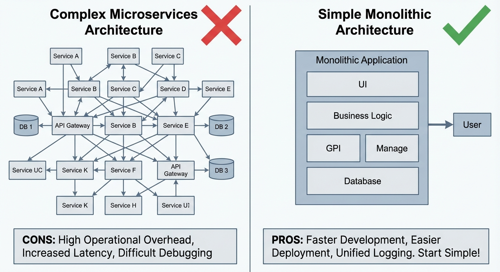
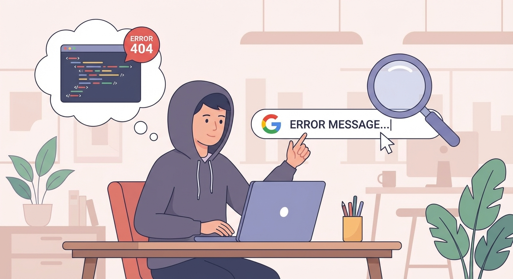
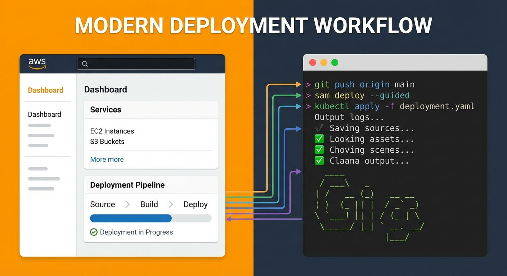

## 들어가며

입사 첫날부터 DB 설계와 백엔드 아키텍처 구성을 맡았다. 사수는 없었다.

신입인 내가 선택한 건 강의에 의존하는 것이었다. 제로초님의 Node.js 강의를 보면서 시작했고, 강의에서 배운 아키텍처와 내 머릿속에 있던 Java Spring 구조를 떠올리며 하나씩 구성해나갔다.

지금 돌아보면 막막했던 그 시간이 가장 많이 성장한 시기였다. 같은 상황에 있는 분들에게 내 경험이 조금이라도 도움이 됐으면 한다.


---

## 1. 강의 선택: 제로초 Node.js

사수가 없으면 강의가 사수다. 나는 제로초님의 Node.js 강의를 선택했다.

### 왜 Node.js였나
- JavaScript 하나로 프론트/백엔드 통일 가능
- npm 생태계가 거대함
- 강의 자료와 커뮤니티가 활성화되어 있음

### 강의에서 얻은 것
- Express 기반 서버 구성
- 미들웨어 개념과 활용법
- Sequelize를 통한 ORM 사용
- Passport.js로 인증 구현


> 💡 **팁**: 강의를 그냥 보지 말고, 반드시 따라 치면서 봐라. 그리고 조금씩 변형해봐라. 그래야 내 것이 된다.

---

## 2. Java Spring 구조를 떠올리며

강의만으로는 부족했다. 구조적인 사고가 필요했다.

학교에서 배웠던 Java Spring의 레이어드 아키텍처가 떠올랐다. Node.js에도 똑같이 적용하면 되지 않을까?

### Spring에서 가져온 개념

```
Controller → Service → Repository → Model
```

이 구조를 Node.js에 그대로 적용했다:

```
📦 내가 구성한 프로젝트 구조
├── src/
│   ├── routes/         # Spring의 Controller 역할
│   ├── services/       # 비즈니스 로직
│   ├── repositories/   # DB 접근 계층 (선택적)
│   ├── models/         # Sequelize 모델
│   ├── middlewares/    # 인증, 에러 처리 등
│   └── utils/          # 공통 유틸리티
├── config/
└── tests/
```



### 왜 이 구조가 좋았나
- **역할 분리**: 각 파일이 하나의 책임만 가짐
- **테스트 용이**: Service 레이어만 따로 테스트 가능
- **유지보수**: 나중에 코드 찾기 쉬움

---

## 3. DB 설계: 처음부터 내 손으로

사수 없이 DB 설계를 하라니. 솔직히 무서웠다.

### 내가 한 접근법

1. **요구사항 정리**: 서비스에서 필요한 데이터가 뭔지 리스트업
2. **엔티티 도출**: 명사를 찾아서 테이블로
3. **관계 정의**: 1:N, N:M 관계 파악
4. **ERD 그리기**: draw.io나 dbdiagram.io 활용



### 실수하고 배운 것들
- 처음부터 완벽하게 설계하려 하지 마라. 어차피 바뀐다.
- 마이그레이션 도구(Sequelize Migration)를 처음부터 써라
- 인덱스는 나중에 성능 이슈 생기면 추가해도 된다

```javascript
// Sequelize 마이그레이션 예시
module.exports = {
  up: async (queryInterface, Sequelize) => {
    await queryInterface.createTable('users', {
      id: {
        type: Sequelize.INTEGER,
        primaryKey: true,
        autoIncrement: true
      },
      email: {
        type: Sequelize.STRING,
        unique: true,
        allowNull: false
      },
      // ...
    });
  },
  down: async (queryInterface) => {
    await queryInterface.dropTable('users');
  }
};
```

---

## 4. 아키텍처 구성: 모놀리식으로 시작

마이크로서비스? 혼자서는 절대 하지 마라.

### 모놀리식을 선택한 이유
- 배포가 단순함 (서버 하나)
- 디버깅이 쉬움 (로그 한 곳에서 확인)
- 트랜잭션 관리가 편함
- 혼자서 운영 가능



### 그래도 확장성은 고려했다

```javascript
// 도메인별로 폴더 분리
src/
├── domains/
│   ├── user/
│   │   ├── user.route.js
│   │   ├── user.service.js
│   │   └── user.model.js
│   ├── post/
│   │   ├── post.route.js
│   │   ├── post.service.js
│   │   └── post.model.js
```

나중에 마이크로서비스로 분리해야 할 때, 도메인 폴더 단위로 떼어내면 된다.

---

## 5. 막힐 때마다 했던 것들

사수가 없으면 구글이 사수다. 진심이다.

### 검색 스킬
- 에러 메시지 **그대로** 검색
- "node.js + [하고 싶은 것]" 검색
- Stack Overflow 답변 중 투표 많은 것 우선



### 유용했던 리소스
- **제로초 블로그**: 강의 내용 복습 + 추가 팁
- **공식 문서**: Express, Sequelize 공식 문서는 필독
- **GitHub 오픈소스**: 실제 프로젝트 구조 참고

### 질문하는 법
혼자 30분 이상 막히면 질문했다. 단, 질문 전에:
1. 내가 뭘 하려는지
2. 어디서 막혔는지
3. 뭘 시도해봤는지

이 세 가지를 정리하고 나면, 절반은 스스로 해결됐다.

---

## 6. 배포까지 혼자서

개발만 하면 끝이 아니다. 배포해야 진짜 서비스다.

### 내가 선택한 스택
- **서버**: AWS EC2 (프리티어)
- **DB**: AWS RDS (PostgreSQL)
- **배포**: PM2 + GitHub Actions



### 처음 배포할 때 삽질한 것들
- 환경변수 설정 빼먹음 → `.env` 파일 서버에 올리기
- 포트 열어야 함 → 보안 그룹 설정
- HTTPS 필요함 → Let's Encrypt + Nginx

```bash
# PM2로 무중단 배포
pm2 start ecosystem.config.js --env production
pm2 save
pm2 startup
```

---

## 7. 돌아보며

3개월이 지나고 보니, 사수 없이 시작한 게 오히려 약이었다.

### 얻은 것
- **전체 그림을 보는 눈**: DB부터 배포까지 모든 과정 경험
- **문제 해결 능력**: 막히면 스스로 찾아서 해결하는 습관
- **자신감**: "나 혼자서도 할 수 있다"는 확신


### 후배에게 하고 싶은 말

1. **강의에 의존해도 된다.** 부끄러운 게 아니다.
2. **다른 언어 지식도 써먹어라.** Java든 Python이든, 구조적 사고는 통한다.
3. **기록해라.** 삽질 기록이 1년 뒤 나를 구한다.
4. **완벽하지 않아도 된다.** 일단 돌아가게 만들고, 점진적으로 개선하자.

---

## 마무리

사수가 없다고 불안해하지 마라. 

제로초 강의 틀어놓고, Spring 구조 떠올리며, 구글 검색하면서 하나씩 해결해나가면 된다. 그게 내가 한 방법이고, 지금도 유효한 방법이다.

혼자서도 충분히 할 수 있다. 화이팅.


---

*이 글이 도움이 됐다면 공유해주세요. 질문은 댓글로 남겨주시면 경험 공유드리겠습니다.*
