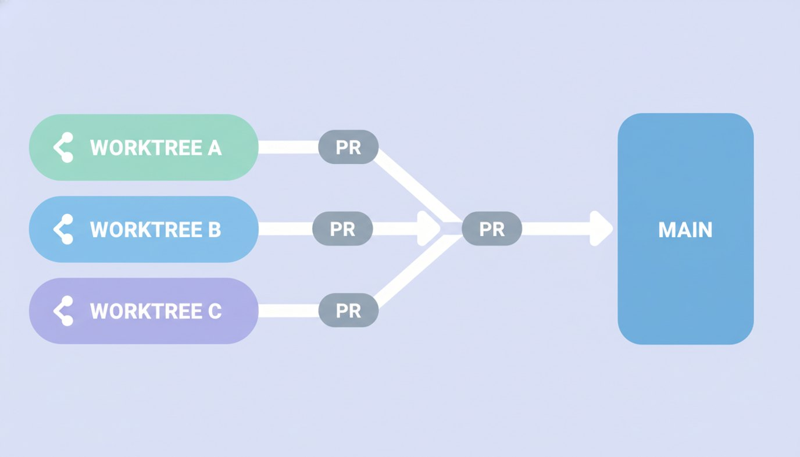
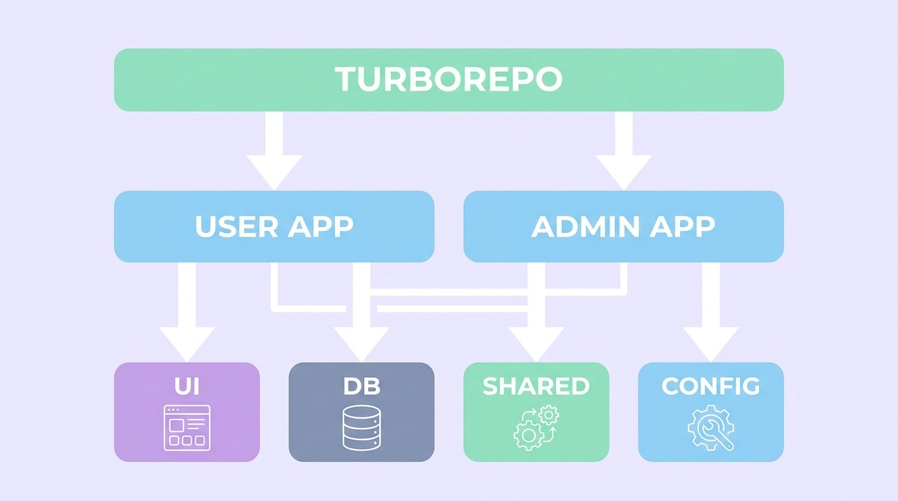

## 혼자서 풀스택, 그것도 두 개의 앱

만들던 건 외국인 대상 한국 쇼핑 구매대행 플랫폼이었다. 외국인이 한국 쇼핑몰에서 산 물건을 대신 받아 합포장으로 배송하고, 자체 큐레이션 상품도 파는 서비스.

규모가 작지 않았다. 사용자 앱과 관리자 앱 두 개, 5개 언어(한·영·일·중·태), PayPal 실결제, Google 로그인, 상품 등록 자동 번역, EMS 무게별 배송비 계산, 외부몰 URL 파싱까지. Next.js 15 + Turborepo 모노레포에 Supabase를 붙인 구조.

혼자 하기엔 기능이 너무 많았다. 그래서 일하는 방식 자체를 바꿨다.

## 한 기능 = 한 워크트리 = 한 PR

핵심은 **git worktree**였다.

기능 하나를 시작할 때마다 새 워크트리를 따고, 거기서 에이전트에게 그 기능만 맡긴다. 메인 작업 공간은 건드리지 않는다. 기능이 끝나면 PR로 올리고, 머지한다. 그 사이 다른 워크트리에서는 또 다른 기능이 굴러간다.

지난 몇 주를 돌아보면 이런 식이었다:

- 무게 기반 배송비 책정 → PR 머지
- 상품 등록 자동 번역 → PR 머지
- PayPal 실결제 연동 → PR 머지
- 지원 국가 번역 오류 수정 → PR 머지
- 푸터 링크 전체 구현 → PR 머지

각각이 독립된 워크트리와 PR이었다. 기능들이 서로의 작업 공간을 오염시키지 않으니, 하나가 막혀도 다른 걸 계속 진행할 수 있었다. 혼자인데도 마치 여러 개의 작업 흐름을 동시에 굴리는 느낌이었다.

## 이 방식이 강제한 좋은 습관

워크트리+PR 워크플로우는 단순한 정리 습관이 아니라, 결과적으로 더 나은 결정을 강제했다.

**작업 단위가 작아진다.** "이번 워크트리에선 이 기능만"이라는 제약이, 한 번에 너무 많은 걸 건드리려는 욕심을 막아줬다. PR이 작으니 검토도 쉽다.

**머지 전에 한 번 멈춘다.** PR이라는 관문이 있으니, 에이전트가 만든 변경을 그냥 흘려보내지 않고 한 번은 들여다보게 된다. "AI가 짰으니 됐겠지"가 아니라, 머지 버튼을 누르기 전에 책임지는 순간이 생긴다.

**컨텍스트가 격리된다.** 모노레포에서 사용자 앱과 관리자 앱, 공용 패키지가 얽혀 있어도, 워크트리별로 작업이 분리되니 "지금 어디서 뭘 하고 있었지"가 흐려지지 않았다.

## 모노레포라서 생긴 함정도 있었다

물론 매끄럽기만 한 건 아니었다. 모노레포 + Supabase 조합엔 특유의 가시들이 있었다.

- **타입 추론이 `never`로 죽는다.** Supabase의 `users` 테이블이 `auth.users`를 FK로 참조하니, 타입 추론이 무너져 `never`가 떴다. 결국 명시적 타입 단언으로 우회.
- **다국어를 어디에 둘까.** 상품명·장단점·트렌드 글 같은 다국어 필드는 JSONB에 `{"ko":"...","en":"..."}` 형태로 넣고, 읽기 헬퍼로 꺼내 쓰는 방식으로 통일했다. 5개 언어를 매번 컬럼으로 쪼개지 않으려고.
- **로케일 자동 선택.** 첫 접속 시 IP 기반으로 언어를 고르되, 쿠키가 있으면 그걸 우선. 글로벌 서비스에선 "처음 본 화면이 무슨 언어냐"가 이탈에 직결되니까.
- **배포는 두 프로젝트로.** 사용자 앱과 관리자 앱을 각각 Vercel 프로젝트로 분리 배포. 한 모노레포에서 둘을 따로 내보내는 설정을 잡는 게 잔손이 갔다.

이런 함정들은 한 번 밟으면 다음부턴 안 밟도록 프로젝트 가이드 문서에 적어뒀다. 에이전트가 새 세션에서 같은 실수를 반복하지 않도록.

## 혼자가 혼자가 아니게 되는 지점

예전 같았으면 이 규모를 혼자 맡는 건 엄두가 안 났을 거다. 결제, 인증, 다국어, 배송비 로직, 두 개의 앱 — 어느 하나도 가볍지 않다.

달라진 건 내 역할이었다. 나는 "이 기능을 이 워크트리에서, 이 범위로" 정하고 방향을 잡는다. 구현의 디테일은 에이전트가 채우고, 나는 PR에서 멈춰 검토하고 머지한다.

코드를 치는 사람에서, **흐름을 설계하고 관문을 지키는 사람**으로. 워크트리와 PR은 그 전환을 가능하게 한 가장 단순하고 강력한 도구였다.
