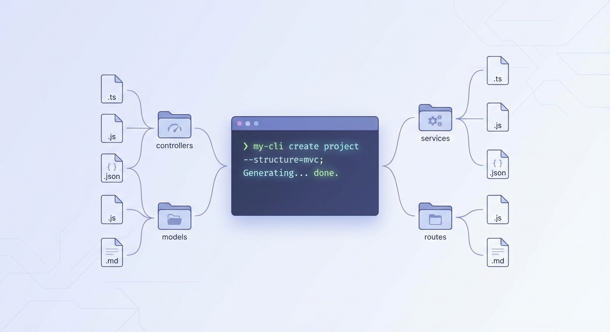
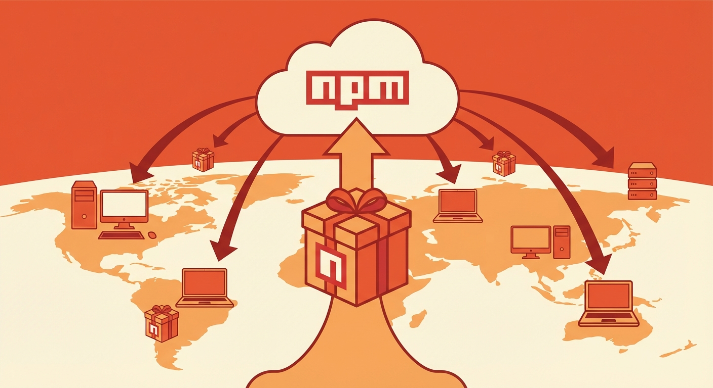

회사에서 새 프로젝트를 시작할 때마다 같은 작업을 반복하고 있었다. Express 프로젝트 초기 설정, TypeScript 설정, 린터 설정, Swagger 연동, 그리고 CRUD API 작성...

"이거 자동화하면 되지 않을까?"

그렇게 시작된 프로젝트가 cucu-generator다.

## 문제 정의

당시 겪고 있던 문제들:

1. **매번 반복되는 초기 설정**: tsconfig, eslint, prettier, swagger... 새 프로젝트마다 30분~1시간 소요
2. **일관성 없는 프로젝트 구조**: 프로젝트마다 폴더 구조가 제각각
3. **CRUD 보일러플레이트**: User, Post, Comment... 엔티티만 다르고 코드는 거의 동일



## 해결책 설계

두 가지 기능을 만들기로 했다.

### 1. 프로젝트 스타터

```bash
$ npx cucu-generator
? Select a template
❯ cucu-project-starter
  crud-generator
```

선택하면 바로 실행 가능한 TypeScript Express 프로젝트가 생성된다.

포함된 것들:
- TypeScript 설정
- ESLint + Prettier
- Swagger UI (`/docs` 엔드포인트)
- Sequelize ORM 연동
- JWT 인증 미들웨어
- 환경변수 관리

### 2. CRUD 제너레이터

```bash
$ npx cucu-generator
? Select a template
  cucu-project-starter
❯ crud-generator

? Entity name: Person
```

실행하면 아래 파일들이 자동 생성된다:

```
src/
├── controllers/
│   └── PersonController.ts
├── services/
│   └── PersonService.ts
├── models/
│   └── Person.ts
├── routes/
│   └── person.routes.ts
└── dto/
    ├── CreatePersonDto.ts
    └── UpdatePersonDto.ts
```

## 구현 과정

### Inquirer.js로 CLI 인터페이스

```typescript
import inquirer from 'inquirer';

const answers = await inquirer.prompt([
  {
    type: 'list',
    name: 'template',
    message: 'Select a template',
    choices: ['cucu-project-starter', 'crud-generator']
  }
]);
```

### 템플릿 엔진으로 코드 생성

EJS를 사용해서 템플릿을 만들었다:

```typescript
// templates/controller.ejs
import { Request, Response } from 'express';
import { <%= entityName %>Service } from '../services/<%= entityName %>Service';

export class <%= entityName %>Controller {
  private service = new <%= entityName %>Service();

  async findAll(req: Request, res: Response) {
    const items = await this.service.findAll();
    res.json(items);
  }

  async findOne(req: Request, res: Response) {
    const item = await this.service.findOne(req.params.id);
    res.json(item);
  }
  // ...
}
```

### npm 배포

```bash
npm login
npm publish
```

처음 npm에 패키지를 배포했을 때의 그 짜릿함이란... 내가 만든 코드가 전 세계 누구나 `npm install`로 설치할 수 있다니.



## 반응

GitHub에 올리고 몇 달 후, 스타가 하나둘 붙기 시작했다. 지금은 14개. 많지 않지만, 누군가는 이 도구가 유용했다는 뜻이다.

특히 뿌듯했던 건 fork가 생겼을 때다. 누군가 내 코드를 가져다가 자기만의 버전을 만들고 있다는 것.

## 배운 점

### 1. CLI 도구 개발의 재미

웹 개발만 하다가 CLI 도구를 만드니 색다른 재미가 있었다. 화면 없이 텍스트만으로 인터랙션하는 게 오히려 집중이 잘 됐다.

### 2. npm 생태계 이해

패키지 배포, 버저닝, peer dependencies 등 npm 생태계를 깊이 이해하게 됐다. 나중에 회사에서 private npm 레지스트리 구축할 때 이 경험이 도움됐다.

### 3. 문서화의 중요성

README 하나 잘 쓰는 게 생각보다 중요했다. GIF로 사용법을 보여주니 스타가 더 붙었다.

## 한계와 아쉬움

지금 보면 아쉬운 점도 많다.

1. **NestJS의 등장**: 이 도구를 만들고 얼마 지나지 않아 NestJS로 전환했다. NestJS CLI가 이미 비슷한 기능을 잘 제공하고 있었다.

2. **유지보수 부재**: 회사 일이 바빠지면서 업데이트를 못 했다. 오픈소스 메인테이너의 어려움을 조금 느꼈다.

3. **테스트 부족**: 테스트 코드 없이 배포했다. 지금이라면 절대 안 그럴 텐데.

## 마무리

cucu-generator는 내 첫 npm 패키지이자 첫 오픈소스 프로젝트다. 비록 지금은 거의 사용하지 않지만, 이 경험이 개발자로서 한 단계 성장하는 계기가 됐다.

누군가 반복 작업에 지쳐있다면, 도구를 만들어보길 추천한다. 그 과정에서 배우는 것들이 예상외로 많다.

GitHub: [cucu-generator](https://github.com/sonbyungjun/cucu)
npm: [cucu-generator](https://www.npmjs.com/package/cucu-generator)
