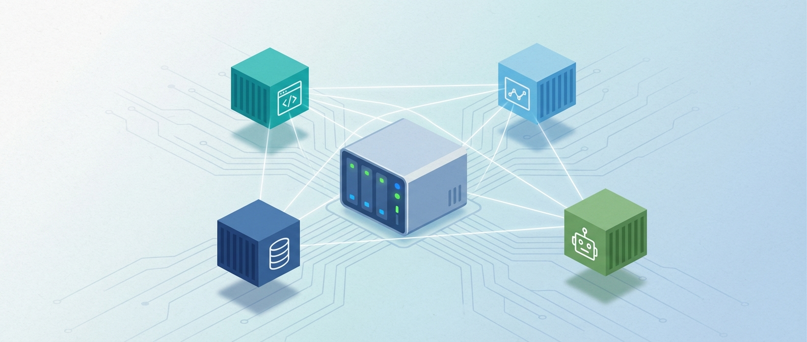
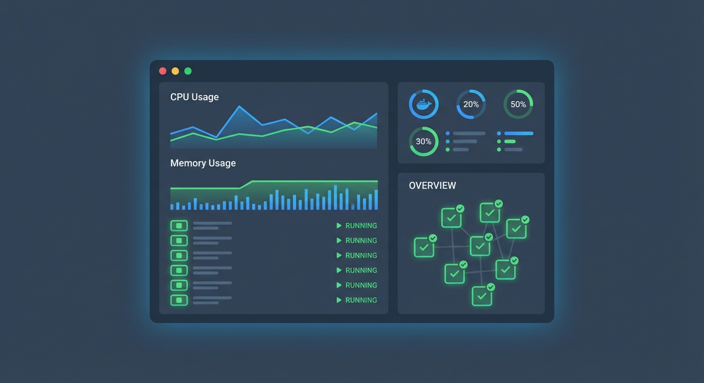

2019년에 NAS를 샀다. 처음엔 단순히 파일 저장용이었다. 4년이 지난 지금, NAS는 내 개인 인프라의 핵심이 됐다.

그 중심에 Docker가 있다.

## 왜 NAS에서 Docker인가

클라우드 서버는 돈이 든다. 사이드 프로젝트 하나에 월 몇만 원씩 쓰기 아깝다.

NAS는 전기세만 내면 된다. 24시간 켜두는 장비에 Docker를 올리면 무료 서버가 생긴다.

물론 한계가 있다:
- 외부 접속이 느리다 (가정용 인터넷)
- 서비스 수준이 낮다 (UPS 없으면 정전에 취약)
- 리소스가 제한적이다 (NAS 스펙에 따라)

그래도 개인용, 사이드 프로젝트용으로는 충분하다.

---



## 현재 운영 중인 컨테이너들

```
CONTAINER ID   NAMES              STATUS
a1b2c3d4e5f6   nginx-proxy        Up 6 months
b2c3d4e5f6g7   blog               Up 3 months
c3d4e5f6g7h8   telegram-bot       Up 2 years
d4e5f6g7h8i9   portainer          Up 1 year
e5f6g7h8i9j0   mysql-dev          Up 8 months
f6g7h8i9j0k1   redis              Up 6 months
g7h8i9j0k1l2   monitoring         Up 4 months
```

### 1. Nginx Proxy Manager

모든 서비스의 관문. 리버스 프록시 + SSL 인증서 자동 갱신.

```yaml
# docker-compose.yml
nginx-proxy:
  image: jc21/nginx-proxy-manager:latest
  ports:
    - "80:80"
    - "443:443"
    - "81:81"
  volumes:
    - ./data:/data
    - ./letsencrypt:/etc/letsencrypt
```

Let's Encrypt 인증서를 자동으로 발급/갱신해준다. HTTPS 설정이 클릭 몇 번으로 끝난다.

### 2. 텔레그램 봇

[NAS 텔레그램 봇](/blog/nas-telegram-bot) 글에서 다뤘던 그 봇. 2년 넘게 무중단 운영 중이다.

```yaml
telegram-bot:
  build: ./telegram-bot
  restart: always
  environment:
    - BOT_TOKEN=${BOT_TOKEN}
    - NAS_API_URL=${NAS_API_URL}
  volumes:
    - /volume1/homes:/data/homes:ro
```

### 3. Portainer

Docker 컨테이너 관리 UI. SSH 없이 웹에서 컨테이너를 관리할 수 있다.

```yaml
portainer:
  image: portainer/portainer-ce:latest
  restart: always
  ports:
    - "9000:9000"
  volumes:
    - /var/run/docker.sock:/var/run/docker.sock
    - portainer_data:/data
```

컨테이너 로그, 상태, 재시작 등을 웹에서 관리. 폰으로도 확인 가능.

### 4. MySQL + Redis

개발용 DB들. 로컬 개발할 때 여기 연결한다.

```yaml
mysql-dev:
  image: mysql:8.0
  restart: always
  environment:
    MYSQL_ROOT_PASSWORD: ${MYSQL_ROOT_PASSWORD}
  volumes:
    - mysql_data:/var/lib/mysql
  ports:
    - "3306:3306"

redis:
  image: redis:alpine
  restart: always
  volumes:
    - redis_data:/data
  ports:
    - "6379:6379"
```

### 5. 모니터링 스택

Prometheus + Grafana로 NAS 상태 모니터링.

```yaml
prometheus:
  image: prom/prometheus
  volumes:
    - ./prometheus.yml:/etc/prometheus/prometheus.yml
  ports:
    - "9090:9090"

grafana:
  image: grafana/grafana
  ports:
    - "3000:3000"
  volumes:
    - grafana_data:/var/lib/grafana
```

CPU, 메모리, 디스크, 네트워크 사용량을 대시보드로 볼 수 있다.

---

## Docker Compose 관리 팁

### 1. 서비스별 디렉토리 분리

```
/volume1/docker/
├── nginx-proxy/
│   └── docker-compose.yml
├── telegram-bot/
│   ├── docker-compose.yml
│   └── src/
├── monitoring/
│   ├── docker-compose.yml
│   └── prometheus.yml
└── databases/
    └── docker-compose.yml
```

한 파일에 다 넣으면 관리가 어렵다. 서비스별로 분리하면 독립적으로 배포/재시작할 수 있다.

### 2. 환경 변수 관리

```bash
# .env
MYSQL_ROOT_PASSWORD=secure_password
BOT_TOKEN=your_telegram_bot_token
DOMAIN=your-domain.com
```

비밀 정보는 `.env` 파일에. Git에는 `.env.example`만 올린다.

### 3. 자동 재시작

```yaml
services:
  app:
    restart: always  # 항상 재시작
    # restart: unless-stopped  # 수동 중지 전까지 재시작
    # restart: on-failure  # 실패 시에만 재시작
```

NAS 재부팅해도 서비스가 자동으로 올라온다.

### 4. 볼륨 백업

```bash
#!/bin/bash
# backup.sh
DATE=$(date +%Y%m%d)
BACKUP_DIR="/volume1/backup/docker"

# 볼륨 백업
docker run --rm \
  -v mysql_data:/data \
  -v $BACKUP_DIR:/backup \
  alpine tar czf /backup/mysql_$DATE.tar.gz /data

# 오래된 백업 삭제 (30일 이상)
find $BACKUP_DIR -name "*.tar.gz" -mtime +30 -delete
```

Synology 작업 스케줄러로 매일 자동 백업.

---

## 외부 접속 설정

### DDNS 설정

가정용 인터넷은 IP가 바뀐다. Synology DDNS를 사용하면 무료로 도메인을 연결할 수 있다.

```
your-name.synology.me → 동적 IP
```

### 포트포워딩

공유기에서 80, 443 포트를 NAS로 포워딩.

```
외부:80  → NAS:80  (HTTP)
외부:443 → NAS:443 (HTTPS)
```

### Nginx Proxy Manager로 라우팅

```
blog.your-domain.com → localhost:4000
bot.your-domain.com  → localhost:3001
grafana.your-domain.com → localhost:3000
```

하나의 IP로 여러 서비스를 도메인으로 분기.

---



## 트러블슈팅 경험담

### 1. 메모리 부족

NAS가 갑자기 느려졌다. 확인해보니 MySQL이 메모리를 다 잡아먹고 있었다.

```yaml
# 메모리 제한 설정
mysql-dev:
  image: mysql:8.0
  deploy:
    resources:
      limits:
        memory: 1G
```

컨테이너별 메모리 제한을 걸어서 해결.

### 2. 디스크 가득 참

Docker 이미지와 로그가 쌓여서 디스크가 찼다.

```bash
# 안 쓰는 이미지/컨테이너 정리
docker system prune -a

# 로그 크기 제한
logging:
  driver: "json-file"
  options:
    max-size: "10m"
    max-file: "3"
```

주기적으로 `docker system prune` 실행하는 스크립트도 만들어뒀다.

### 3. 컨테이너 간 통신

처음엔 IP로 통신하려다 삽질했다. Docker network를 쓰면 컨테이너 이름으로 통신할 수 있다.

```yaml
networks:
  app-network:
    driver: bridge

services:
  app:
    networks:
      - app-network
  db:
    networks:
      - app-network
```

```javascript
// app에서 db 접속
const connection = mysql.connect({
  host: 'db',  // 컨테이너 이름으로 접속
  port: 3306,
});
```

---

## NAS Docker의 한계

솔직히 말하면, 프로덕션 서비스에는 부적합하다.

1. **속도**: 가정용 인터넷 업로드 속도 제한
2. **안정성**: 정전, 공유기 재부팅 등에 취약
3. **보안**: 가정 네트워크 노출 위험
4. **확장성**: 스케일 아웃 불가

AWS, GCP 같은 클라우드가 있는 이유다.

하지만 이런 용도로는 충분하다:
- 개인 프로젝트
- 개발/테스트 환경
- 자동화 봇
- 백업 서버
- 홈 네트워크 서비스

---

## 마무리

NAS + Docker 조합으로 4년간 개인 인프라를 운영했다. 월 비용 0원에 24시간 돌아가는 서버.

처음엔 단순히 파일 저장소였던 NAS가 이제는 없으면 불편한 핵심 인프라가 됐다.

Docker를 모르던 시절에는 NAS에 직접 서비스를 설치했다. 업데이트하면 설정이 꼬이고, 삭제해도 찌꺼기가 남았다.

Docker를 쓰고 나서는 깔끔하다. 컨테이너 지우면 끝. 다른 버전 테스트도 이미지만 바꾸면 된다.

집에 놀고 있는 NAS가 있다면, Docker 한번 올려보길 추천한다.

---

*다음 글: [GitHub Actions로 CI/CD 구축하기](/blog/github-actions-cicd)*
