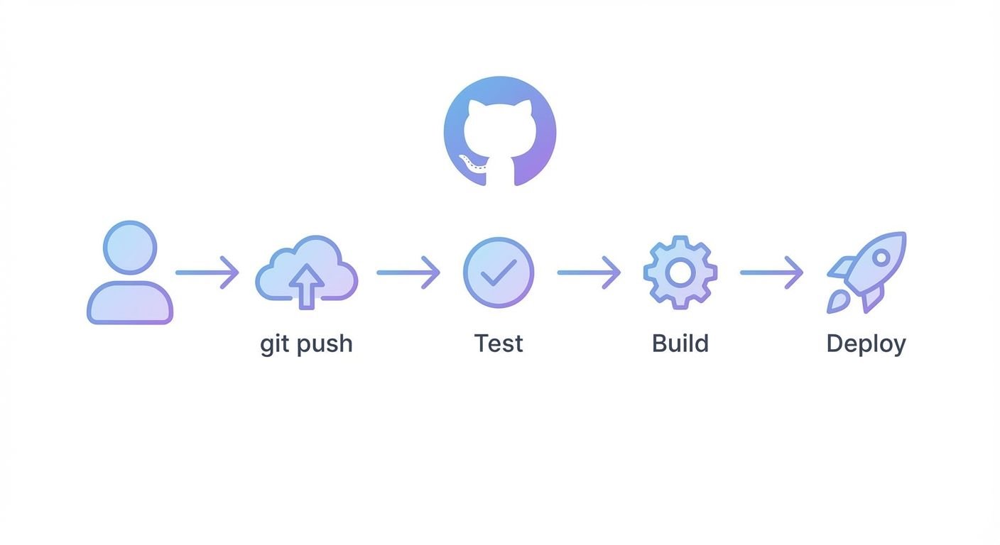

"야 배포 좀 해줘."

하루에 몇 번씩 듣던 말이다. 개발 끝나면 서버 접속해서 `git pull`, `npm run build`, `pm2 restart`. 배포할 때마다 5분씩 날렸다.

GitHub Actions를 도입하고 나서, 이제 push만 하면 알아서 배포된다.



## CI/CD가 필요했던 이유

### Before: 수동 배포

```bash
# 매번 반복하던 것들
ssh user@server
cd /var/www/app
git pull origin main
npm install
npm run build
pm2 restart app
```

문제점:
1. **시간 낭비**: 하루 5번 배포 × 5분 = 25분
2. **휴먼 에러**: 실수로 다른 브랜치 pull
3. **병목**: 배포할 줄 아는 사람만 배포
4. **야근 유발**: "퇴근 전에 이것만 배포해주세요"

### After: 자동 배포

```
push to main → 테스트 → 빌드 → 배포 (자동)
```

push만 하면 끝. 집에서도, 카페에서도, 폰으로도 배포 가능.

---

## 기본 워크플로우 구조

```yaml
# .github/workflows/deploy.yml
name: Deploy

on:
  push:
    branches: [main]
  pull_request:
    branches: [main]

jobs:
  test:
    runs-on: ubuntu-latest
    steps:
      - uses: actions/checkout@v3
      - uses: actions/setup-node@v3
        with:
          node-version: '18'
      - run: npm ci
      - run: npm test

  deploy:
    needs: test
    runs-on: ubuntu-latest
    if: github.ref == 'refs/heads/main'
    steps:
      - name: Deploy to server
        run: |
          # 배포 스크립트
```

핵심 개념:
- **on**: 언제 실행할지 (push, PR, schedule 등)
- **jobs**: 실행할 작업들
- **needs**: 의존성 (test 통과해야 deploy 실행)
- **steps**: 각 작업의 단계들

---

## NestJS 백엔드 CI/CD

### 테스트 & 빌드

```yaml
name: Backend CI/CD

on:
  push:
    branches: [main, develop]
  pull_request:
    branches: [main]

jobs:
  test:
    runs-on: ubuntu-latest
    
    services:
      mysql:
        image: mysql:8.0
        env:
          MYSQL_ROOT_PASSWORD: test
          MYSQL_DATABASE: test_db
        ports:
          - 3306:3306
        options: >-
          --health-cmd="mysqladmin ping"
          --health-interval=10s
          --health-timeout=5s
          --health-retries=3

    steps:
      - uses: actions/checkout@v3
      
      - name: Setup Node.js
        uses: actions/setup-node@v3
        with:
          node-version: '18'
          cache: 'npm'
      
      - name: Install dependencies
        run: npm ci
      
      - name: Run tests
        run: npm test
        env:
          DB_HOST: localhost
          DB_PORT: 3306
          DB_USERNAME: root
          DB_PASSWORD: test
          DB_DATABASE: test_db
      
      - name: Build
        run: npm run build
```

MySQL 서비스를 띄워서 실제 DB 연결 테스트까지 진행.

### SSH 배포

```yaml
  deploy:
    needs: test
    runs-on: ubuntu-latest
    if: github.ref == 'refs/heads/main'
    
    steps:
      - name: Deploy via SSH
        uses: appleboy/ssh-action@master
        with:
          host: ${{ secrets.SERVER_HOST }}
          username: ${{ secrets.SERVER_USER }}
          key: ${{ secrets.SSH_PRIVATE_KEY }}
          script: |
            cd /var/www/backend
            git pull origin main
            npm ci --production
            npm run build
            pm2 restart backend
```

### Docker 배포

```yaml
  deploy:
    needs: test
    runs-on: ubuntu-latest
    if: github.ref == 'refs/heads/main'
    
    steps:
      - uses: actions/checkout@v3
      
      - name: Login to Docker Hub
        uses: docker/login-action@v2
        with:
          username: ${{ secrets.DOCKER_USERNAME }}
          password: ${{ secrets.DOCKER_TOKEN }}
      
      - name: Build and push
        uses: docker/build-push-action@v4
        with:
          push: true
          tags: myapp/backend:latest
      
      - name: Deploy to server
        uses: appleboy/ssh-action@master
        with:
          host: ${{ secrets.SERVER_HOST }}
          username: ${{ secrets.SERVER_USER }}
          key: ${{ secrets.SSH_PRIVATE_KEY }}
          script: |
            docker pull myapp/backend:latest
            docker-compose up -d
```

Docker 이미지 빌드 → Docker Hub 푸시 → 서버에서 pull & restart.

---

## Flutter 앱 CI/CD

### Android 빌드

```yaml
name: Android Build

on:
  push:
    branches: [main]
    tags:
      - 'v*'

jobs:
  build:
    runs-on: ubuntu-latest
    
    steps:
      - uses: actions/checkout@v3
      
      - name: Setup Java
        uses: actions/setup-java@v3
        with:
          distribution: 'zulu'
          java-version: '11'
      
      - name: Setup Flutter
        uses: subosito/flutter-action@v2
        with:
          flutter-version: '3.13.0'
          cache: true
      
      - name: Get dependencies
        run: flutter pub get
      
      - name: Run tests
        run: flutter test
      
      - name: Build APK
        run: flutter build apk --release
      
      - name: Build App Bundle
        run: flutter build appbundle --release
      
      - name: Upload APK
        uses: actions/upload-artifact@v3
        with:
          name: app-release
          path: build/app/outputs/flutter-apk/app-release.apk
```

### iOS 빌드

```yaml
name: iOS Build

on:
  push:
    branches: [main]

jobs:
  build:
    runs-on: macos-latest
    
    steps:
      - uses: actions/checkout@v3
      
      - name: Setup Flutter
        uses: subosito/flutter-action@v2
        with:
          flutter-version: '3.13.0'
          cache: true
      
      - name: Get dependencies
        run: flutter pub get
      
      - name: Build iOS
        run: flutter build ios --release --no-codesign
      
      # 실제 배포는 Fastlane 사용 권장
```

iOS는 인증서, 프로비저닝 프로파일 때문에 설정이 복잡하다. Fastlane 조합을 추천.

---

## 실전 팁

### 1. 캐시 활용

```yaml
- name: Cache node modules
  uses: actions/cache@v3
  with:
    path: ~/.npm
    key: ${{ runner.os }}-node-${{ hashFiles('**/package-lock.json') }}
    restore-keys: |
      ${{ runner.os }}-node-
```

의존성 캐시로 빌드 시간 단축. npm ci가 2분 → 20초로.

### 2. 환경별 분기

```yaml
deploy-staging:
  if: github.ref == 'refs/heads/develop'
  # staging 배포

deploy-production:
  if: github.ref == 'refs/heads/main'
  # production 배포
```

develop → staging, main → production 자동 배포.

### 3. Secrets 관리

```yaml
env:
  DB_PASSWORD: ${{ secrets.DB_PASSWORD }}
  API_KEY: ${{ secrets.API_KEY }}
```

민감 정보는 GitHub Secrets에. 레포 Settings > Secrets에서 설정.

### 4. 슬랙 알림

```yaml
- name: Slack Notification
  uses: 8398a7/action-slack@v3
  with:
    status: ${{ job.status }}
    fields: repo,message,commit,author
  env:
    SLACK_WEBHOOK_URL: ${{ secrets.SLACK_WEBHOOK }}
  if: always()
```

배포 성공/실패를 슬랙으로 알림. `if: always()`로 실패해도 알림.

### 5. PR 체크

```yaml
on:
  pull_request:
    branches: [main]

jobs:
  lint:
    runs-on: ubuntu-latest
    steps:
      - uses: actions/checkout@v3
      - run: npm ci
      - run: npm run lint
  
  test:
    runs-on: ubuntu-latest
    steps:
      - uses: actions/checkout@v3
      - run: npm ci
      - run: npm test
```

PR에서 lint + test 통과해야 머지 가능하게 설정.

---


## 우리 팀 워크플로우

```
feature/* → develop → main
    ↓          ↓        ↓
   PR체크   staging   production
```

1. feature 브랜치에서 개발
2. develop으로 PR → 자동 테스트
3. 머지되면 staging 자동 배포
4. 확인 후 main으로 PR
5. 머지되면 production 자동 배포

수동 배포 제로. 코드 리뷰만 하면 된다.

---

## 비용

GitHub Actions는 public repo에서 무료다.

private repo도 월 2000분 무료. 우리 팀은 월 500분 정도 쓴다.

빌드 시간 줄이면 비용도 줄어든다:
- 캐시 활용
- 병렬 실행
- 필요한 것만 설치

---

## 마무리

GitHub Actions 도입 전후:

| Before | After |
|--------|-------|
| 배포 5분 | 배포 0분 (push만) |
| 서버 접속 필요 | 필요 없음 |
| 배포 담당자 필요 | 누구나 가능 |
| 테스트 건너뛰기 | 강제 테스트 |
| "배포해주세요" | push하세요 |

CI/CD는 한번 세팅하면 계속 쓴다. 초기 투자 시간이 아깝지 않다.

Jenkins, GitLab CI 등 다른 도구도 있지만, GitHub 쓴다면 Actions가 가장 편하다. 별도 서버 필요 없고, YAML만 작성하면 된다.

다음 프로젝트에서는 처음부터 CI/CD 세팅하고 시작할 예정이다.

---

*관련 글: [NAS에서 Docker로 개인 인프라 구축하기](/blog/docker-nas-experience)*
