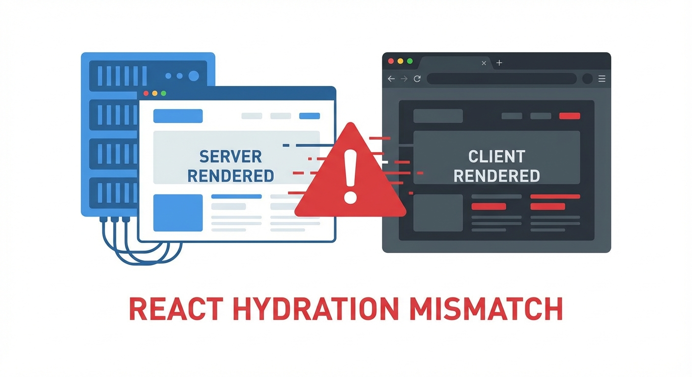

## 프로젝트 개요

**프로젝트**: LRM (Legend State 기반 웹앱)  
**개발 기간**: 2025.09 (약 1주)  
**기술 스택**: Next.js, TypeScript, Legend State, Tailwind CSS  
**주요 작업**: 12 commits

---

## 왜 Legend State인가

기존 프로젝트는 Zustand를 쓰고 있었다. 잘 동작했지만 몇 가지 불편함이 있었다:

- 상태 변경 시 수동으로 불변성 관리
- 깊은 객체 업데이트가 번거로움
- 파생 상태(computed) 처리가 애매함

Legend State는 이런 문제를 해결해준다:

```typescript
// Zustand - 불변성 직접 관리
set((state) => ({
  user: {
    ...state.user,
    profile: {
      ...state.user.profile,
      name: newName
    }
  }
}));

// Legend State - 직접 수정 가능
state.user.profile.name.set(newName);
```

---

## 마이그레이션 시작

```bash
63ed205 2025-09-05 feat: Legend State로 전역 상태 관리 마이그레이션
```

기본적인 마이그레이션은 간단했다.

```typescript
// store.ts
import { observable } from '@legendapp/state';

export const appState$ = observable({
  user: null,
  theme: 'light',
  settings: {
    notifications: true,
    language: 'ko'
  }
});
```

컴포넌트에서 사용:

```typescript
import { observer } from '@legendapp/state/react';

const Profile = observer(function Profile() {
  const user = appState$.user.get();
  
  return <div>{user?.name}</div>;
});
```

---



## Hydration 지옥의 시작

```bash
651dd54 2025-09-08 fix: React hydration mismatch 오류 해결
```

배포하고 나니 콘솔에 빨간 에러가 도배됐다.

```
Warning: Text content did not match. 
Server: "light" Client: "dark"
```

React의 hydration mismatch 에러. 서버에서 렌더링한 HTML과 클라이언트에서 렌더링한 결과가 다르다는 뜻이다.

### 원인

문제는 테마 설정이었다. 클라이언트에서는 localStorage의 테마를 읽어오고, 서버에서는 기본값을 사용했다.

```typescript
// 문제의 코드
const theme = localStorage.getItem('theme') || 'light'; // 서버에서 에러!
```

서버에는 localStorage가 없다.

---

## 해결 과정

### 1차 시도: useEffect로 클라이언트 전용 처리

```typescript
const [theme, setTheme] = useState('light'); // 서버 기본값

useEffect(() => {
  const saved = localStorage.getItem('theme');
  if (saved) setTheme(saved);
}, []);
```

이렇게 하면 에러는 사라지지만, **깜빡임**이 생긴다. 서버에서 light로 렌더링했다가 클라이언트에서 dark로 바뀌면서 화면이 번쩍인다.

### 2차 시도: Legend State의 persistObservable

Legend State는 localStorage 동기화를 지원한다.

```typescript
import { persistObservable } from '@legendapp/state/persist';

const appState$ = observable({
  theme: 'light'
});

// 클라이언트에서만 실행
if (typeof window !== 'undefined') {
  persistObservable(appState$, {
    local: 'app-state'
  });
}
```

하지만 이것도 hydration 문제를 완전히 해결하진 못했다.

### 최종 해결: configureObservablePersistence

```typescript
import { configureObservablePersistence } from '@legendapp/state/persist';
import { ObservablePersistLocalStorage } from '@legendapp/state/persist-plugins/local-storage';

// 앱 초기화 시 한 번만 실행
configureObservablePersistence({
  persistLocal: ObservablePersistLocalStorage,
  persistLocalOptions: {
    // SSR 환경에서는 persist 비활성화
    disabled: typeof window === 'undefined'
  }
});
```

그리고 hydration이 끝난 후에만 localStorage 값을 사용하도록:

```typescript
const ThemeProvider = observer(function ThemeProvider({ children }) {
  const [hydrated, setHydrated] = useState(false);
  
  useEffect(() => {
    setHydrated(true);
  }, []);
  
  // hydration 전에는 기본 테마 사용
  const theme = hydrated ? appState$.theme.get() : 'light';
  
  return (
    <div data-theme={theme}>
      {children}
    </div>
  );
});
```

---

## 추가 개선

### 반응형 레이아웃 실시간 적용

```bash
1e002f1 2025-09-05 fix: 채팅 페이지 반응형 레이아웃 실시간 적용 수정
```

Legend State의 좋은 점 중 하나는 상태 변경이 자동으로 컴포넌트를 업데이트한다는 것.

```typescript
// 윈도우 크기를 상태로 관리
const layoutState$ = observable({
  isMobile: false
});

// 리사이즈 이벤트 연결
useEffect(() => {
  const handleResize = () => {
    layoutState$.isMobile.set(window.innerWidth < 768);
  };
  
  window.addEventListener('resize', handleResize);
  handleResize(); // 초기값
  
  return () => window.removeEventListener('resize', handleResize);
}, []);
```

이렇게 하면 화면 크기가 바뀔 때 관련 컴포넌트만 자동으로 리렌더링된다.

### 테마 토글 버튼

```bash
628bf0d 2025-09-05 refactor: 불필요한 로직 제거 및 테마 토글 버튼 추가
```

```typescript
const ThemeToggle = observer(function ThemeToggle() {
  const theme = appState$.theme.get();
  
  const toggle = () => {
    appState$.theme.set(theme === 'light' ? 'dark' : 'light');
  };
  
  return (
    <button onClick={toggle}>
      {theme === 'light' ? '🌙' : '☀️'}
    </button>
  );
});
```

상태 변경 한 줄로 테마 전환. 깔끔하다.

---

## 배운 점

### 1. SSR + 클라이언트 상태는 항상 충돌한다

서버에서 렌더링하고 클라이언트에서 hydrate하는 구조에서, 클라이언트 전용 데이터(localStorage, 브라우저 정보 등)는 항상 문제가 된다.

**해결 원칙**: 서버와 클라이언트 첫 렌더링은 동일하게, 그 후에 클라이언트 데이터 반영

### 2. Legend State의 장점

- 직관적인 API (`.get()`, `.set()`)
- 자동 구독 (observer로 감싸면 끝)
- 내장 persist 지원
- 좋은 TypeScript 지원

### 3. observer 패턴의 이해

```typescript
// 이렇게 하면 전체 상태 변경에 반응
const Component = observer(() => {
  const state = appState$.get();  // 전체 객체
  return <div>{state.user.name}</div>;
});

// 이렇게 하면 name 변경에만 반응
const Component = observer(() => {
  const name = appState$.user.name.get();  // 특정 값만
  return <div>{name}</div>;
});
```

필요한 상태만 구독하면 불필요한 리렌더링을 줄일 수 있다.

---

## 마무리

```bash
2681ed0 2025-09-09 파비콘 업데이트
b3a1dbd 2025-09-09 헤더와 토스트 컴포넌트 제거
```

1주일간의 마이그레이션 끝에 Legend State 기반 앱이 완성됐다.

Hydration 에러 때문에 이틀을 날렸지만, 덕분에 React SSR의 동작 방식을 깊이 이해하게 됐다. Legend State 자체는 만족스럽다. 특히 깊은 객체 업데이트가 편해진 게 체감된다.

---

*상태관리 라이브러리는 많지만, 결국 중요한 건 SSR과의 호환성이다.*
