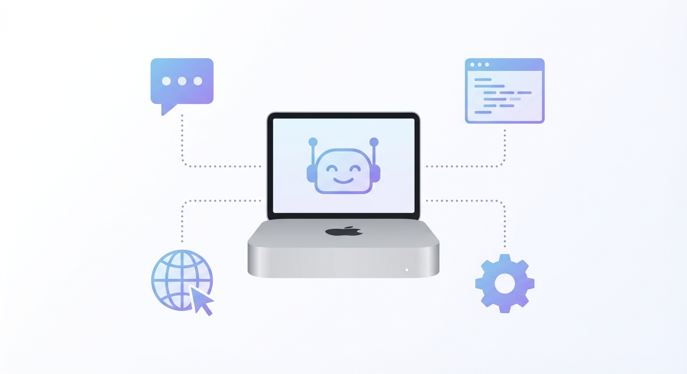
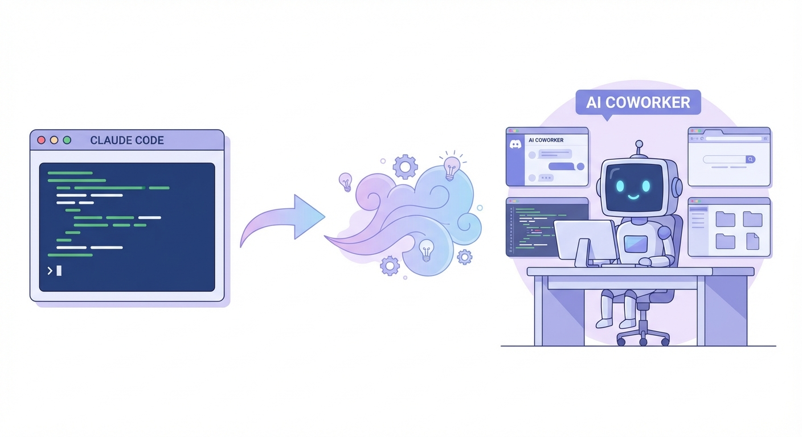

## Claude Code를 쓰던 개발자가 에이전트에 빠진 이유

AI 코딩 도구는 이미 쓰고 있었다.

Claude Code로 터미널에서 코드 생성, 리팩토링, 버그 수정. 충분히 편했다. 그런데 어느 순간 한계가 보이기 시작했다.

- 프로젝트마다 터미널 세션을 따로 열어야 했다
- 코드 외의 작업(테스트, 배포, 리뷰)은 여전히 수동이었다
- "어제 뭐 했더라?" — AI는 기억하지 못했다

코딩 도구가 아니라 **함께 일하는 비서**가 필요했다.

그러다 친구한테 OpenClaw라는 걸 소개받았다. AI 에이전트가 내 맥에서 직접 돌면서, 디스코드로 대화하고, 파일을 만들고, 명령어를 실행하고, 심지어 브라우저까지 열 수 있다고 했다.

5분 구경하고 맥미니를 질렀다. 충동구매였다.

---



## 맥미니 하나로 AI 비서를 만들다

OpenClaw는 로컬 머신에서 돌아가는 AI 에이전트 프레임워크다.

핵심은 이거다:
- **디스코드**(또는 텔레그램/슬랙)로 대화
- AI가 **로컬 파일 시스템**에 직접 접근
- **셸 명령어** 실행 가능
- **브라우저** 제어 가능
- **크론 잡**으로 반복 작업 자동화
- **메모리 시스템**으로 컨텍스트 유지

맥미니에 OpenClaw를 설치하고 디스코드 봇으로 연결했다. 이제 디스코드 채팅창에 "이거 해줘"라고 치면 AI가 내 컴퓨터에서 직접 작업한다.

---

## 실제로 시킨 것들

### 1. 자연어로 풀스택 개발

"파트너 제휴문의 기능 만들어줘. 백엔드 API, 프론트 폼, 어드민 승인/거절 버튼까지."

이 한 마디로 벌어지는 일:

```
1. NestJS 백엔드에 모델/컨트롤러/서비스 생성
2. DB 마이그레이션 실행
3. Next.js 프론트에 폼 컴포넌트 추가
4. 어드민 페이지에 목록 + 승인/거절 UI 추가
5. 빌드 확인
6. git commit & push
7. 배포
```

한 세션에서 백엔드 → 프론트 → 어드민 → DB → 배포까지 전부 처리된다. 중간에 에러가 나면 알아서 고친다.

예전 같았으면 파일 수십 개 오가며 반나절은 걸렸을 작업이 대화 몇 번으로 끝난다.

---

### 2. 테스트 자동화 — 브라우저까지 직접 열어서

"방금 만든 기능 E2E 테스트 해줘."

AI가 puppeteer를 돌려서 브라우저를 직접 연다. 폼을 채우고, 버튼을 클릭하고, 스크린샷을 찍어서 HTML 리포트를 만들어준다.

```
테스트 결과:
✅ 폼 입력 정상
✅ 제출 후 리다이렉트 정상
✅ 어드민 목록에 신규 항목 표시
❌ 썸네일 미리보기 경로 오류 → 자동 수정 완료
```

테스트하다 버그를 발견하면 그 자리에서 고치고 다시 테스트한다. 사람이 할 일은 결과를 확인하는 것뿐이다.

---

### 3. 크론으로 반복 업무 자동화

OpenClaw에는 크론 잡 기능이 있다.

**매일 아침 9시 — AI/개발 뉴스 브리핑:**
AI가 Hacker News, GeekNews 등을 크롤링해서 주요 뉴스를 정리하고, HTML 리포트를 생성한 뒤 텔레그램으로 보내준다. 출근 전에 읽으면 된다.

**30분마다 — 사이드 프로젝트 헬스체크:**
자동매매 봇이 돌아가고 있는데, 30분마다 heartbeat을 확인해서 멈추면 자동으로 재시작하고 알림을 보내준다.

이런 걸 한 번 세팅하면 알아서 돌아간다. 서버 모니터링을 AI가 해주는 셈이다.

---

### 4. 디버깅 — 에러 로그만 던져주면 끝

"이 에러 고쳐줘."

```
TypeError: Cannot read properties of undefined (reading 'status')
    at PartnerList.tsx:47
```

이 로그 하나 붙여넣으면:

1. 해당 파일을 열어서 47번 줄 확인
2. 원인 분석 (API 응답에 status 필드 누락)
3. 백엔드 DTO 확인 → OpenAPI 클라이언트 동기화 문제 발견
4. 클라이언트 재생성 또는 수동 패치
5. 빌드 확인 후 커밋

에러 메시지를 복붙하는 것만으로 근본 원인까지 추적해서 고친다. 심지어 OpenClaw 자체의 버그를 소스코드까지 파고들어서 패치한 적도 있다.

---

### 5. 아이디어 논의 — 코딩 그 너머

이게 Claude Code와 가장 다른 점이다.

- **코인 자동 차익거래 시스템**: "거래소 간 가격 차이로 수익 낼 수 있을까?" → 아이디어 논의 → 시스템 설계 → 구현까지
- **뉴스 자동 수집**: "매일 아침 AI 트렌드 읽고 싶은데" → 크론 잡 설계 → 크롤링 로직 구현 → 텔레그램 전송
- **GitHub 커밋 분석**: "내가 지금까지 어떤 기술 스택을 써왔는지 분석해줘" → 과거 커밋 히스토리 크롤링 → 기술 변화 타임라인 도출

코딩 도구한테는 "이 함수 만들어줘"만 할 수 있다. 비서한테는 "이거 어떻게 생각해?"부터 시작할 수 있다.

---

## 편한 점

### 디스코드 채널 = 프로젝트 워크스페이스

디스코드 서버에 채널을 프로젝트별로 만들었다.

```
#프로젝트-A  → 사이드 프로젝트 프론트/백엔드
#프로젝트-B  → 회사 프로젝트
#투자        → 자동매매 봇 관리
#블로그      → 콘텐츠 작업
```

각 채널은 독립된 세션이라 컨텍스트가 섞이지 않는다. #프로젝트-A에서 하던 얘기가 #투자로 넘어가지 않는다.

터미널 창 여러 개 띄우던 시절과 비교하면 관리가 압도적으로 편하다.

### 서브에이전트 — 작업 분산

"이미지 5개 만들어줘"라고 하면 서브에이전트가 따로 생성되어 백그라운드에서 작업한다. 메인 대화는 끊기지 않는다.

이미지 생성, 반복 작업, 시간 오래 걸리는 분석 등을 위임할 수 있어서 효율이 배로 늘었다.

### 코드 → 빌드 → 배포 한 줄기

"이거 수정하고 배포해줘."

코드 수정 → `npm run build` → 에러 없으면 `git commit && push` → 자동 배포 트리거. 이 과정이 하나의 대화에서 끝난다.

---

## 불편한 점

솔직히 말하면, 완벽하진 않다.

### 컨텍스트 유실

AI 에이전트의 가장 큰 한계다. 대화가 길어지거나 세션이 바뀌면 **이전 내용을 까먹는다**.

"아까 만든 그 컴포넌트 있잖아" → "죄송합니다, 어떤 컴포넌트인지 알 수 없습니다."

이걸 방지하려면 중요한 맥락은 항상 **"이거 기억해놔"**라고 명시적으로 지시해야 한다. AI가 자체 메모리 파일에 기록하긴 하는데, 알아서 다 기억하진 못한다.

### "메모리에서 찾아줘"

기억 못하는 걸 알았을 때 할 수 있는 건 "메모리 파일에서 찾아봐"라고 요청하는 것이다. 대부분 찾아주긴 하지만, 이 한 마디를 매번 해야 한다는 게 번거롭다.

이상적으로는 AI가 "이건 이전에 다뤘던 건데..."라고 알아서 꺼내줘야 한다. 아직은 그 수준이 아니다.

### 토큰 비용

Opus급 모델을 쓰면 비용이 꽤 나온다. 복잡한 작업 하나에 대화가 길어지면 토큰이 빠르게 소모된다. 모델 선택이나 컨텍스트 관리를 신경 써야 한다.

---



## 코딩 도구가 아니라 비서다

OpenClaw를 쓰면서 가장 크게 달라진 건 **AI를 대하는 관점**이다.

ChatGPT/Copilot은 "질문하면 답해주는 도구"다.
Claude Code는 "코드를 짜주는 도구"다.
OpenClaw는 **"함께 일하는 비서"**다.

비서한테는 이렇게 말한다:
- "오늘 할 일 뭐야?"
- "이 아이디어 어떻게 생각해?"
- "이거 좀 알아봐줘"
- "뉴스 브리핑 해줘"

코딩만 시키는 게 아니라, 내 프로젝트 전체를 이해하고 있는 존재와 대화하는 느낌이다. 물론 까먹는 것도 사람 비서랑 비슷하다. 중요한 건 메모해두라고 해야 한다.

아직 완벽하진 않지만, 방향은 분명하다. AI가 "도구"에서 "동료"로 넘어가는 과도기에 서 있다. 지금 시점에서 에이전트형 AI를 경험해보는 건, 단순히 새 도구를 배우는 게 아니라 **일하는 방식 자체를 바꾸는 것**이다.

맥미니 하나면 시작할 수 있다. 충동구매치고는 꽤 괜찮았다.
