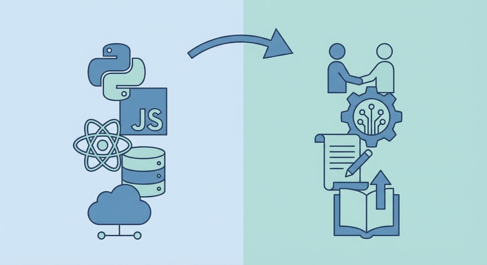

## 어느 날 문득

2023년 초, 코드를 치는데 손이 멈췄다.

머리로는 뭘 해야 하는지 안다. CRUD API 만들면 된다. 수백 번 해본 거다.

근데 흥미가 없다.

5년차. 어느새 꽤 됐다. 2019년에 입사해서 매년 뭔가 새로웠다.

- 1년차: 모든 게 새로웠다
- 2년차: Express 마스터
- 3년차: NestJS 전환
- 4년차: GraphQL, Flutter 도전

그런데 5년차. 올해는 뭐가 새롭지?

---

## 반복의 늪

돌이켜보면 3년차 이후로 비슷한 일을 반복했다.

```
새 프로젝트 시작
→ NestJS 보일러플레이트 복사
→ 엔티티 정의
→ CRUD 생성
→ 인증/인가 붙이기
→ 배포
→ 유지보수
→ (처음으로)
```

물론 프로젝트마다 도메인은 다르다. 커머스도 하고, 채팅 앱도 하고, 예약 시스템도 했다.

하지만 기술적으로? 똑같다.

TypeORM으로 엔티티 만들고, Service에서 비즈니스 로직 처리하고, Controller에서 API 뚫고.

눈 감고도 할 수 있다. 그게 문제다.

---

## 성장이 멈춘 건가?

GitHub 커밋 이력을 봤다. 2022년 이후로 개인 프로젝트가 없다.

회사 일만 했다. 회사 일이 나쁜 건 아니다. 하지만 회사 일은 **안전한 선택**을 하게 된다.

- 새로운 기술? 리스크. 검증된 거 쓰자.
- 아키텍처 실험? 시간 없어. 기존 구조대로.
- 리팩토링? 돌아가는 거 건드리지 마.

어느 순간 "개발자"가 아니라 "코더"가 된 느낌.

---

## 내가 시도한 것들

정체기를 인정하고 몇 가지 시도했다.

### 1. 사이드 프로젝트

오랜만에 개인 프로젝트를 시작했다. 회사에서 못 쓰는 기술을 일부러 골랐다.

- Rust 백엔드 (Axum)
- Svelte 프론트엔드
- 새로운 DB (Supabase)

결과? 3주 만에 포기.

시간이 없었다. 회사 일 끝나고 집에 오면 9시. 밥 먹고 씻으면 10시. 1-2시간 코딩하고 자야 한다.

주말? 쉬고 싶다.

### 2. 기술 블로그 읽기

Hacker News, 개발 블로그, 기술 아티클을 열심히 읽었다.

신기술 소식은 많이 알게 됐다. 하지만 아는 것과 하는 것은 다르다.

지식만 쌓이고 실력은 그대로.

### 3. 이직 고민

"환경을 바꾸면 달라지지 않을까?"

채용 공고를 봤다. 연봉은 좀 오를 것 같다. 하지만 하는 일은 비슷해 보였다.

결국 이직은 하지 않았다.

---

## 깨달은 것

몇 달간 방황하다 깨달은 게 있다.

**정체기는 나쁜 게 아니다.**

신입 때는 매일 새로운 걸 배웠다. 그게 당연했다. 아무것도 모르니까.

5년차가 되면 웬만한 건 안다. 새로운 걸 배우려면 **의도적으로** 찾아야 한다.

그리고 "성장"의 정의가 바뀌어야 한다.

### 과거의 성장

- 새 언어 배우기
- 새 프레임워크 익히기
- 새 기술 적용하기

### 지금의 성장

- 더 좋은 설계 하기
- 더 유지보수하기 쉬운 코드 쓰기
- 더 효율적인 협업 방식 찾기



눈에 보이는 성장에서 눈에 안 보이는 성장으로.

---

## 2023년을 보낸 방법

결국 이렇게 보냈다.

### 기존 코드 리팩토링

새 프로젝트 대신 기존 프로젝트를 개선했다.

- 테스트 코드 추가 (커버리지 0% → 60%)
- 성능 최적화 (쿼리 개선, 인덱스 추가)
- 코드 리뷰 문화 정착

### 문서화

머릿속에만 있던 지식을 문서로 만들었다.

- 온보딩 가이드
- 아키텍처 결정 기록 (ADR)
- 트러블슈팅 매뉴얼

### 주니어 멘토링

후배 개발자에게 알려주면서 나도 배웠다.

설명하려면 정리해야 한다. 정리하면서 내가 몰랐던 부분을 발견했다.

---

## 정체기는 끝났나?

솔직히 모르겠다. 아직 정체기일 수도 있다.

하지만 불안하지는 않다.

성장에는 여러 방향이 있다. 기술만 파는 게 성장이 아니다.

- 팀을 더 좋게 만드는 것
- 후배를 성장시키는 것
- 안정적인 시스템을 만드는 것

이것도 성장이다.

---

## 5년차 개발자에게

비슷한 상황이라면 이런 걸 권한다.

1. **조급해하지 마라** - 매년 새로운 걸 배울 필요 없다
2. **깊이를 파라** - 새로운 것보다 기존 것을 더 잘하자
3. **기록하라** - 알고 있는 것을 문서화하자
4. **가르쳐라** - 가르치면서 배운다

정체기는 재정비 기간이다.

다음 도약을 위한 준비 시간.

---

*다음 글: [AI 시대, 개발자로 살아남기](/blog/ai-era-developer)*
