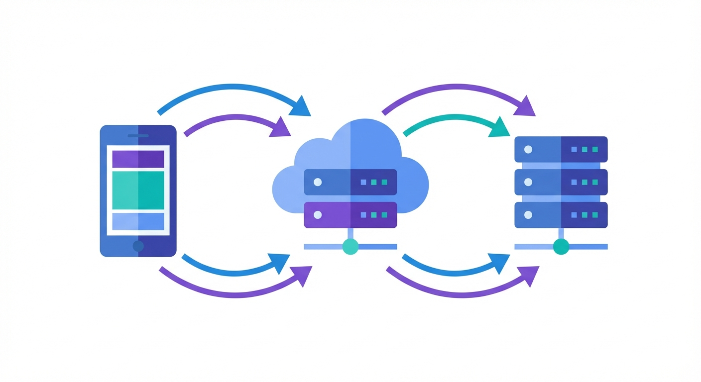

## 프로젝트 개요

**프로젝트**: PAI API (인앱결제 백엔드)  
**개발 기간**: 2025.07 ~ 2025.09 (약 2개월)  
**기술 스택**: Node.js, TypeScript, RevenueCat Webhook  
**주요 작업**: 24 commits

---

## 왜 RevenueCat인가

모바일 앱에서 구독 결제를 구현하려면 생각보다 많은 걸 처리해야 한다:

- iOS App Store 연동
- Google Play 연동
- 구독 상태 관리
- 영수증 검증
- 환불 처리

각 플랫폼별로 따로 구현하면 코드가 2배로 늘어난다. RevenueCat은 이 모든 걸 통합해서 처리해준다.

---

## 웹훅 이벤트 구조

RevenueCat에서 오는 이벤트 종류:

```
INITIAL_PURCHASE      // 최초 구독
RENEWAL               // 자동 갱신
CANCELLATION          // 구독 취소
EXPIRATION            // 구독 만료
UNCANCELLATION        // 취소 철회
```

이 이벤트들을 웹훅으로 받아서 처리하면 된다. 간단해 보이지만...



---

## 구현 과정

### 첫 번째 커밋: 기본 웹훅 처리

```bash
ffd4464 2025-07-01 feat: revenuecat webhook 이벤트 처리
```

기본적인 웹훅 수신과 이벤트 라우팅을 구현했다.

```typescript
// 이벤트 타입별 처리
switch (event.type) {
  case 'INITIAL_PURCHASE':
    await handleInitialPurchase(event);
    break;
  case 'RENEWAL':
    await handleRenewal(event);
    break;
  // ...
}
```

### 두 번째 단계: 중복 구독 방지

```bash
c771d10 2025-07-03 fix: 구독처리 시 중복구독 방지
5180919 2025-07-03 fix: 웹훅 구독결제 구현
```

문제가 생겼다. 같은 사용자가 빠르게 버튼을 두 번 누르면 구독이 중복 생성됐다.

해결책: 트랜잭션 ID로 중복 체크

```typescript
const existing = await db.subscription.findUnique({
  where: { transactionId: event.transactionId }
});

if (existing) {
  return { status: 'already_processed' };
}
```

---

## 가장 어려웠던 버그

### 취소와 만료가 동시에 오는 경우

```bash
6b047c1 2025-07-28 fix: 취소, 만료 동시에 들어왔을때 버그 수정
```

사용자가 구독을 취소하면 RevenueCat에서 두 개의 이벤트가 온다:

1. `CANCELLATION` - 취소됨
2. `EXPIRATION` - 만료됨

문제는 이 두 이벤트가 **거의 동시에** 도착할 때 발생한다.

```
시간순서:
1. CANCELLATION 처리 시작
2. EXPIRATION 처리 시작 (동시에!)
3. CANCELLATION 완료 → 구독 상태: 취소
4. EXPIRATION 완료 → 구독 상태: 만료 (덮어씀!)
```

둘 다 DB를 업데이트하면서 레이스 컨디션이 발생했다.


### 해결책: 이벤트 우선순위와 락

```typescript
// 이벤트 우선순위 정의
const eventPriority = {
  'INITIAL_PURCHASE': 1,
  'RENEWAL': 2,
  'CANCELLATION': 3,
  'EXPIRATION': 4,
};

// 낙관적 락으로 동시 업데이트 방지
await db.subscription.update({
  where: { 
    id: subscriptionId,
    version: currentVersion  // 버전 체크
  },
  data: {
    status: newStatus,
    version: currentVersion + 1
  }
});
```

`EXPIRATION`보다 `CANCELLATION`이 먼저 처리되도록 우선순위를 두고, 낙관적 락으로 동시 업데이트를 방지했다.

---

## 샌드박스 환경 분리

```bash
8e70dad 2025-08-14 fix: 샌드박스 환경 분리하기
```

App Store 심사 중에는 샌드박스 결제만 들어온다. 이걸 실제 결제와 분리해야 했다.

```typescript
const isSandbox = event.environment === 'SANDBOX';

if (isSandbox) {
  // 테스트 계정만 처리
  if (!testEmails.includes(userEmail)) {
    return { status: 'ignored' };
  }
}
```

---

## 크레딧 관리 로직

```bash
3e3166d 2025-09-01 fix: 구독 크레딧 관리 로직 개선
5f1dce4 2025-07-16 fix: 구독 만료시 사용량 초기화
```

구독 상품마다 월간 크레딧이 다르다. 갱신되면 크레딧 충전, 만료되면 초기화.

```typescript
// 구독 갱신 시
await db.user.update({
  where: { id: userId },
  data: {
    credits: plan.monthlyCredits,
    creditsResetAt: nextMonth
  }
});

// 구독 만료 시
await db.user.update({
  where: { id: userId },
  data: {
    credits: 0,
    subscriptionStatus: 'expired'
  }
});
```

---

## 배운 점

### 1. 웹훅은 순서를 보장하지 않는다

같은 구독에 대한 이벤트가 순서대로 올 거라고 기대하면 안 된다. 항상 이벤트 타임스탬프를 확인하고, 최신 상태만 반영해야 한다.

### 2. 멱등성이 핵심

같은 이벤트가 여러 번 와도 결과가 같아야 한다. 트랜잭션 ID로 중복 체크하는 건 기본이다.

### 3. 테스트 환경 분리는 처음부터

샌드박스 분리를 나중에 하려니 기존 로직을 다 건드려야 했다. 처음부터 환경 분기를 넣어두자.

### 4. 로그는 생명줄

```bash
a4679f1 2025-07-11 fix: 이벤트 로그 추가
715b9d2 2025-07-07 fix: 결제로그 및 상품 추가
```

결제 관련 버그는 재현하기 어렵다. 모든 이벤트를 상세하게 로깅해야 나중에 디버깅할 수 있다.

---

## 마무리

인앱결제는 단순해 보이지만 엣지 케이스가 정말 많다.

- 네트워크 지연으로 이벤트 순서 꼬임
- 동시 이벤트로 레이스 컨디션
- 환불, 부분 환불, 업그레이드, 다운그레이드...

RevenueCat이 플랫폼별 복잡성은 숨겨주지만, 비즈니스 로직은 직접 짜야 한다. 이번 프로젝트로 구독 결제 시스템의 깊은 곳까지 이해하게 됐다.

---

*결제 관련 버그는 돈과 직결된다. 테스트 또 테스트하자.*
