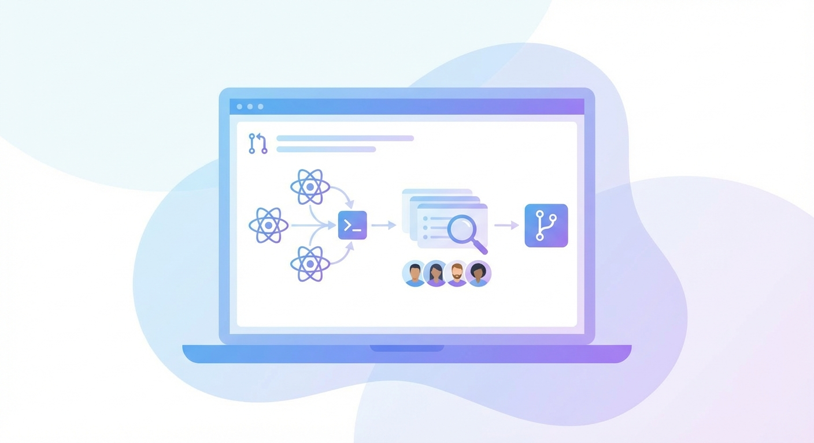

## 들어가며

최근 2달간 llami 프로젝트에서 30개가 넘는 PR을 올리고 머지했다. 네이티브 앱과 백엔드 API를 오가며 버그를 잡고, 새 기능을 만들고, 리뷰를 받았다. 그 과정에서 느낀 점들을 정리해본다.

---

## 어떤 작업들을 했나

### llami-native-app (모바일 앱)

가장 많은 PR이 올라간 곳이다. 주요 작업들:

**버그 수정**
- `PR #209` - 새로고침 시 무한루프 문제 해결
- `PR #208` - 클립보드 로직 수정
- `PR #198` - 채팅방 접근 차단 버그
- `PR #197` - 에러 시 채팅방 생성되는 버그

**기능 개발**
- `PR #203` - 이미지 다운로드 버튼 추가
- `PR #190` - 메모리 체크 기능
- `PR #155` - 크레딧 시스템 구현
- `PR #174` - 온라인 AI 로그인 체크

**UI/UX 개선**
- `PR #195` - 모델 선택 버튼 UI 변경
- `PR #170` - 크레딧 모달 테마 적용
- `PR #168` - 키보드 열릴 때 메시지 스크롤

### pai-api (백엔드)

구독과 결제 시스템을 담당했다:

```
PR #317 - 구독 크레딧 관리 로직 개선
PR #316 - 샌드박스 환경 분리
PR #315 - RevenueCat 웹훅 처리
```

웹훅으로 들어오는 구독 이벤트(갱신, 취소, 만료, 재구독)를 처리하는 로직을 짰다. 결제 시스템은 엣지 케이스가 많아서 꽤 까다로웠다.

---



## 리뷰 과정에서 배운 것들

### 1. 작은 PR이 좋은 PR이다

처음엔 기능 하나 만들 때 관련된 것들을 다 넣었다. 리뷰어 입장에선 지옥이었을 거다. 

지금은 하나의 PR에 하나의 목적만 담는다:
- `fix: 클립보드 로직 수정` - 클립보드만
- `feat: 메모리 체크 기능` - 메모리 체크만

리뷰 시간도 줄고, 문제 생겼을 때 롤백도 쉽다.

### 2. 커밋 메시지는 미래의 나를 위한 것

```
fix: 버그 수정  (X)
fix: 온라인 모델에서 새로고침 시 무한루프 문제 해결  (O)
```

3개월 뒤에 git log 볼 때 "이게 뭐였지?" 하지 않으려면 구체적으로 써야 한다.

### 3. 웹훅은 믿으면 안 된다

RevenueCat 웹훅 작업하면서 배웠다. 같은 이벤트가 두 번 올 수도 있고, 순서가 뒤바뀔 수도 있다. 

```javascript
// 중복 방지 로직 필수
if (alreadyProcessed(eventId)) return;
```

### 4. 브릿지 패턴의 함정

웹뷰와 네이티브 통신할 때 브릿지를 썼는데, 타이밍 이슈가 많았다. `webview-ref-manager`를 만들어서 해결했지만, 처음부터 상태 관리를 잘 설계했으면 더 좋았을 것.

---

## 숫자로 보는 2달

- **총 PR**: 30+
- **버그 수정**: 15개
- **새 기능**: 10개
- **가장 큰 작업**: 크레딧/구독 시스템

7월 말~8월 초가 가장 바빴다. 구독 시스템 런칭 전이라 프론트와 백엔드를 동시에 작업해야 했다.

---

## 마무리

PR을 많이 올린다고 좋은 게 아니다. 하지만 많이 올리다 보면 자연스럽게 배우게 되는 것들이 있다:

- 어떻게 쪼개야 리뷰하기 좋은지
- 어떻게 설명해야 의도가 전달되는지  
- 어떤 코드가 문제를 일으키는지

앞으로도 계속 PR 날리면서 성장해야지.
