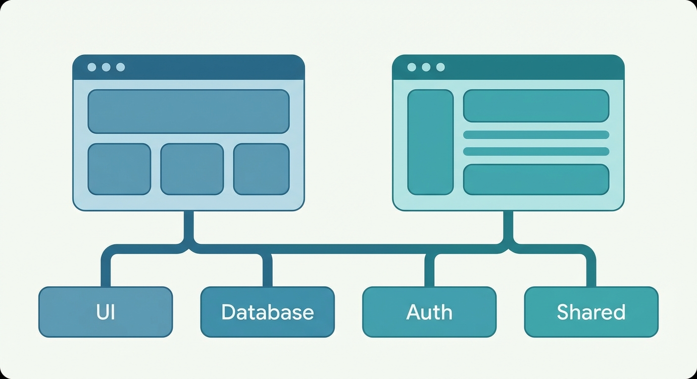

## 바이브 코딩이란?

2025년, 개발 방식이 바뀌고 있다.

예전에는 구글링하고, 스택오버플로우 뒤지고, 문서 읽고, 직접 타이핑했다. 이제는 AI와 대화하며 코딩한다. 이걸 **바이브 코딩(Vibe Coding)**이라고 부른다.

- 원하는 것을 말로 설명한다
- AI가 코드를 생성한다
- 결과를 보고 피드백한다
- 반복한다

단순히 코드를 복붙하는 게 아니다. AI와 페어 프로그래밍을 하는 느낌이다.

---

## 프로젝트 소개: Pet Story

회사에서 새 프로젝트를 시작했다. 반려동물 관련 AI 서비스.

**주요 기능:**
- **포토펫**: AI로 반려동물 초상화 생성
- **무브펫**: 사진을 비디오로 변환
- **안심부적**: 반려동물 맞춤 부적 생성

**기술 스택:**
- Next.js 15 (App Router)
- TypeScript
- Supabase (PostgreSQL + Auth)
- TossPayments (결제)
- Cloudflare R2 (파일 저장)
- Google AI Gemini

4일 만에 MVP를 만들어야 했다. 혼자서.

---

## Day 1: 모노레포 구축

### 첫 커밋

```bash
git log --oneline
90b60bc 펫스토리 모노레포 완전 구현
```

Claude Code에게 말했다.

> "Next.js 15 기반 모노레포 구조 만들어줘. 사용자 앱이랑 어드민 앱 분리하고, 공통 패키지로 UI, DB, Auth 분리해줘."

5분 뒤, 이런 구조가 나왔다:



```
pet-story-monorepo/
├── apps/
│   ├── web/        # 사용자 앱 (포트 3000)
│   └── admin/      # 관리자 앱 (포트 3001)
├── packages/
│   ├── shared/     # 공통 타입, 유틸리티
│   ├── database/   # Supabase 클라이언트
│   ├── ui/         # shadcn/ui 컴포넌트
│   └── auth/       # JWT, SMS 인증
└── turbo.json      # Turbo 설정
```

pnpm workspace + Turbo 조합. 직접 했으면 반나절은 걸렸을 설정이다.

### 배포 지옥

Railway에 배포하려는데 에러가 터졌다.

```bash
49be1a9 타입 에러 수정 및 빌드 문제 해결
c9dc1d9 tailwindcss-animate 패키지 추가로 admin 앱 빌드 에러 해결
a2d57e8 Railway 배포를 위한 start 스크립트 수정
84f33a6 Railway 배포 완전 수정: 직접 next start 명령어 사용
```

4번의 커밋 끝에 해결했다.

이때 느낀 점: **AI가 만들어준 코드도 배포 환경에서는 문제가 생긴다.** 특히 모노레포는 경로 문제가 많다.

---

## Day 2: 환경변수와의 싸움

### Supabase 연결 문제

로컬에서는 잘 되는데 Railway에서 안 됐다.

```bash
336721c 환경 변수 로딩 디버깅 추가
5490b7d Railway 환경 변수 추가 디버깅
cf25888 NEXT_PUBLIC_ 접두사로 SUPABASE_SERVICE_ROLE_KEY 접근 시도
219f1c3 서버사이드 환경변수 접근 방식 수정
cfa4e63 Railway 환경변수 런타임 로딩 문제 해결
```

문제는 Turbo의 환경변수 처리 방식이었다.

Claude에게 물었다.

> "Turbo 모노레포에서 환경변수가 앱에 안 전달돼. 어떻게 해?"

`turbo.json`에 환경변수를 명시적으로 선언해야 했다:

```json
{
  "globalEnv": [
    "SUPABASE_URL",
    "SUPABASE_SERVICE_ROLE_KEY",
    "NEXT_PUBLIC_SUPABASE_URL"
  ]
}
```

이런 건 문서에도 잘 안 나온다. AI와 삽질하며 찾았다.

---

## Day 3: 핵심 기능 구현

환경 세팅이 끝나니 기능 구현은 빨랐다.

### 관리자 페이지

```bash
213f8fc 관리자 예약관리 페이지 데이터 조회 오류 수정
9f77627 관리자 사이드바 메뉴 임시 비활성화
2866577 안심부적 예약 관리 시스템 개선
```

> "예약 목록 테이블 만들어줘. 검색, 필터, 페이지네이션 필요해."

shadcn/ui의 DataTable 컴포넌트를 기반으로 뚝딱 만들어졌다.

### UI 다듬기

```bash
2353199 input placeholder 스타일을 연한 회색으로 변경
6f8b39f UI 컴포넌트 placeholder 스타일 정리
```

세부 스타일 조정도 말로 했다.

> "placeholder 색이 너무 진해. 연한 회색으로 바꿔줘."

---

## Day 4: 결제 연동 & 마무리

### TossPayments 연동

```bash
a97d4c0 안심부적 결제 후 이미지 생성 기능 수정
6db3b8f 결제 시스템 및 서비스 흐름 개선
```

결제 연동은 까다롭다. 웹훅, 검증, 에러 처리...

> "TossPayments 결제 연동해줘. 결제 성공하면 AI 이미지 생성 트리거하고, 실패하면 롤백해줘."

트랜잭션 처리까지 포함된 코드가 나왔다. 물론 테스트하면서 몇 번 수정했지만.

### 최종 커밋

```bash
b8f6124 fix: update
```

4일 만에 배포 완료.

---

## 바이브 코딩의 장단점

### 장점

**1. 속도가 미친다**

4일 만에 모노레포 + 2개 앱 + 결제 + AI 연동. 혼자서는 2주 이상 걸렸을 작업이다.

**2. 보일러플레이트에서 해방**

설정 파일, 타입 정의, CRUD... 지루한 작업을 AI가 해준다.

**3. 새로운 기술 진입 장벽 낮춤**

Turbo 모노레포 처음 써봤다. 문서 읽을 필요 없이 AI한테 물어보며 배웠다.

### 단점

**1. 디버깅은 여전히 내 몫**

AI가 만든 코드도 버그가 있다. 특히 배포 환경에서.

**2. 맥락 유지가 어려움**

대화가 길어지면 AI가 이전 맥락을 까먹는다. CLAUDE.md 파일로 프로젝트 컨텍스트를 유지했다.

**3. 과신은 금물**

AI가 "이렇게 하면 돼요"라고 해도 틀릴 때가 있다. 검증은 필수.

---

## 배운 것들

### 1. CLAUDE.md의 중요성

프로젝트 구조, 기술 스택, 컨벤션을 문서화해두면 AI가 더 정확한 코드를 만든다.

```markdown
## Tech Stack
- Framework: Next.js 15.2.4 with App Router
- Database: Supabase (PostgreSQL)
- UI: Tailwind CSS + shadcn/ui
```

### 2. 작게 요청하기

"전체 앱 만들어줘" ❌

"로그인 API 만들어줘" → "JWT 검증 미들웨어 추가해줘" → "에러 핸들링 추가해줘" ✅

### 3. 직접 이해하기

AI가 만든 코드도 읽고 이해해야 한다. 블랙박스로 두면 나중에 고생한다.

---

## 마치며

바이브 코딩은 미래가 아니라 현재다.

개발자의 역할이 바뀌고 있다. 코드를 타이핑하는 사람에서 **코드를 설계하고 검증하는 사람**으로.

Pet Story는 내 첫 바이브 코딩 프로젝트였다. 4일 만에 MVP를 만들며 느꼈다.

**AI는 동료다. 좋은 동료를 잘 활용하는 것도 실력이다.**

다음 프로젝트도 Claude와 함께할 예정이다.

---

*이 글도 AI의 도움을 받아 작성했다. 커밋 로그를 분석하고, 내용을 정리하는 데 10분 걸렸다.*
