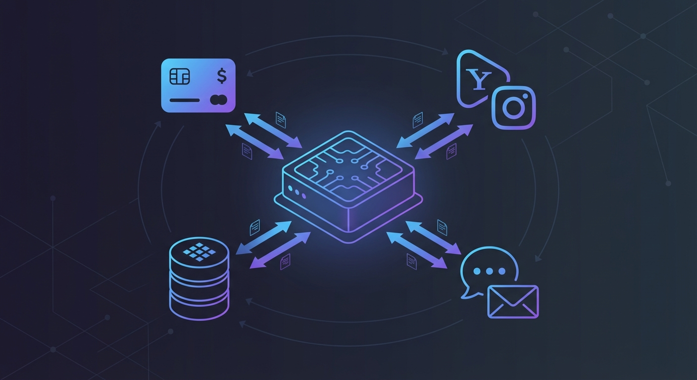
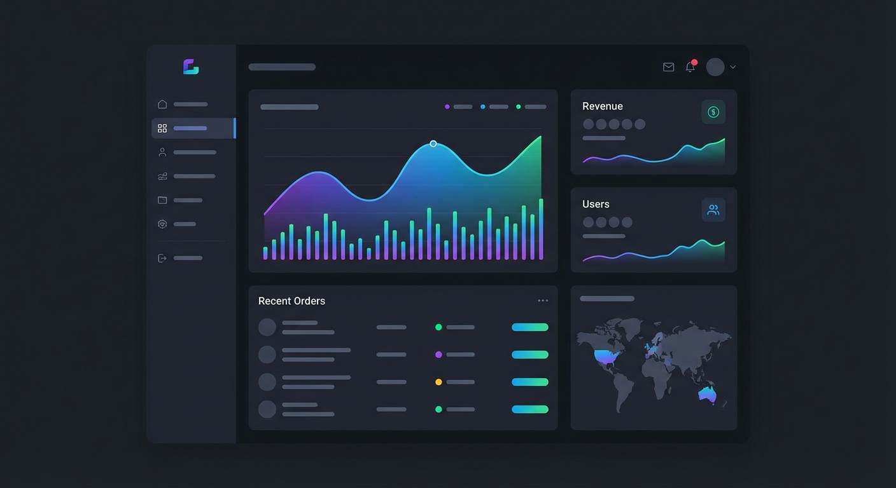

## 들어가며

[1편](/blog/vibe-coding-pet-story)에서 Pet Story를 만들며 바이브 코딩에 맛을 들였다. 이번엔 더 도전적인 프로젝트를 해봤다.

**use(유즈)** - 유튜브, 인스타그램 조회수를 늘려주는 프록시 서비스.

외부 API 연동, 결제 시스템, 실시간 주문 관리, 관리자 대시보드. 혼자 만들면 최소 2주는 잡아야 할 규모다.

3일 만에 MVP를 완성했다.

---

## 프로젝트 개요

### 왜 만들었나

유튜브나 인스타그램 조회수 증가 서비스는 이미 많다. 근데 대부분 UI가 구리고, 사용성이 별로다.

- 깔끔한 다크 모드 UI
- 전화번호만으로 간편 로그인
- 실시간 주문 상태 확인
- 자동화된 프록시 요청

이런 걸 만들고 싶었다.

### 기술 스택

```
- Next.js 14 (App Router)
- TypeScript
- Supabase (PostgreSQL + Auth)
- TossPayments (결제)
- SMMKings API (프록시 서비스)
- solapi (SMS 인증)
- Valtio (상태 관리)
- Tailwind CSS + shadcn/ui
```

---

## Day 1: 프로젝트 초기화 & 핵심 기능

### 첫 커밋들

```bash
735dd34 Initial commit
5084d74 project init
b03549d 기능: 조회수 증가 도구 구현
ee663a5 feat: 프록시 요청 서비스 개선
409253d feat: Supabase 로깅 기능 구현
5449c14 feat: 관리자 대시보드 구현
```

하루 만에 6개 커밋. Claude에게 말했다.

> "유튜브 URL 입력받아서 조회수 늘려주는 서비스 만들어줘. Next.js 14 App Router 쓰고, Supabase로 DB 연결해줘."

기본 구조가 뚝딱 나왔다:

```
app/
├── (auth)/           # 로그인/회원가입
├── (main)/           # 메인 서비스
├── api/              # API 라우트
├── actions/          # Server Actions
├── components/       # UI 컴포넌트
└── core/             # 비즈니스 로직
```

### ViewIncreaser 컴포넌트

핵심 컴포넌트다. URL 입력 → 모드 선택 → 조회수 입력 → 주문.

> "3단계 스텝 UI로 만들어줘. 1단계: URL 입력, 2단계: 모드 선택, 3단계: 조회수 입력. 각 단계마다 유효성 검사하고."

shadcn/ui 기반으로 깔끔하게 나왔다. 다크 모드까지 완벽하게.

### Supabase 연동

```bash
409253d feat: Supabase 로깅 기능 구현
```

모든 요청과 응답을 Supabase에 로깅. 나중에 디버깅할 때 유용하다.

> "proxy_logs 테이블 만들어서 요청 시간, URL, 상태, 응답 다 저장해줘."

마이그레이션 파일까지 자동 생성.

---



## Day 2: 외부 API 연동 & 주문 시스템

### SMMKings API 연동

조회수 증가는 직접 구현하는 게 아니다. 전문 서비스의 API를 사용한다.

```bash
9abd93f SMMKings API 클라이언트 및 유튜브 조회수 증가 서비스 구현
b3f1ead 리포지토리 패턴 도입 및 코드 리팩토링
96153d8 프록시 서비스 싱글톤 패턴 적용
```

> "SMMKings API 연동해줘. 주문 생성, 상태 조회, 잔액 확인 기능 필요해. 에러 핸들링 꼼꼼하게."

API 클라이언트가 깔끔하게 나왔다:

```typescript
class SMMKingsClient {
  async createOrder(serviceId: string, link: string, quantity: number) {
    // 주문 생성 로직
  }
  
  async getOrderStatus(orderId: string) {
    // 상태 조회 로직
  }
  
  async getBalance() {
    // 잔액 확인 로직
  }
}
```

### 주문 관리 시스템

```bash
65e3a8a 주문 관리 시스템 개선 및 커스텀 서버 설정
f0c9144 세션 기반 주문 조회 기능 구현
54f8224 주문 취소 버튼에 프로세싱 기능 추가
```

주문 테이블이 필요했다.

> "orders 테이블 만들어줘. 사용자별로 주문 조회, 취소 가능하게. 상태는 pending, processing, completed, failed로."

테이블 설계부터 CRUD까지 한 번에.

### 커스텀 서버 도입

Next.js 기본 서버로는 한계가 있었다. 크론 작업이 필요했다.

```bash
65e3a8a 주문 관리 시스템 개선 및 커스텀 서버 설정
```

`server.ts`를 만들어 Express 기반 커스텀 서버 구축. node-cron으로 주기적인 상태 체크.

---

## Day 3: 결제 & 관리자 기능

### TossPayments 연동

```bash
9482df9 토스페이먼츠 웹훅 처리 및 사용자 잔액 관리 기능 구현
051fa08 입금 신청 및 실시간 입금 알림 기능 구현
637d923 관리자 기능 추가: 충전 메뉴 및 입금 승인 기능 구현
```

결제는 까다롭다. 웹훅, 검증, 롤백...

> "TossPayments 가상계좌 입금 연동해줘. 웹훅으로 입금 확인되면 사용자 잔액 충전하고."

웹훅 엔드포인트 구현:

```typescript
// 간소화된 예시
app.post('/api/webhook/toss', async (req, res) => {
  const { status, orderId, amount } = req.body;
  
  if (status === 'DONE') {
    await updateUserBalance(orderId, amount);
    await sendSmsNotification(orderId);
  }
});
```

### SMS 알림

```bash
915978a feat: SMMKings API 잔액 부족 시 SMS 알림 기능 추가
```

솔라피(solapi) 연동. 입금 완료, 잔액 부족 등 중요한 이벤트를 SMS로 알림.

> "솔라피 연동해서 SMS 보내는 유틸 만들어줘. 입금 완료되면 알림 가게."

### 관리자 대시보드

```bash
5449c14 feat: 관리자 대시보드 구현
637d923 관리자 기능 추가: 충전 메뉴 및 입금 승인 기능 구현
```



관리자용 페이지. 전체 주문 조회, 입금 승인, 사용자 관리.

> "관리자 대시보드 만들어줘. 주문 전체 리스트, 수동 입금 승인, 통계 그래프."

Tremor 차트 라이브러리로 깔끔한 통계 화면까지.

---

## 이후 개선들

### 인스타그램 지원 (3월)

```bash
d5cd4d2 feat: URL 유효성 검사 로직 개선 및 인스타그램 URL 지원 추가
e3e3c56 feat: 인스타그램 모드 개선 및 조회수 관련 모드 추가
```

유튜브만 되던 걸 인스타그램으로 확장.

> "인스타그램 URL도 지원하게 해줘. 프로필, 게시물, 릴스, 스토리 URL 다 처리하게."

URL 파서 로직 추가:

```typescript
function isValidInstagramUrl(url: string): boolean {
  // instagram.com/username (프로필)
  // instagram.com/p/코드 (게시물)
  // instagram.com/reel/코드 (릴스)
  // instagram.com/stories/username/코드 (스토리)
}
```

### 유튜브 라이브 채팅 (5월)

```bash
b0868da feat: youtube service 구현
7bfc9b2 feat: youtube live 구현체 작성
```

단순 조회수뿐 아니라 라이브 채팅 지원까지 확장.

---

## 바이브 코딩 실전 팁

### 1. 외부 API는 래핑하라

SMMKings API를 직접 호출하지 않고, 클라이언트 클래스로 감쌌다.

```typescript
// ❌ 나쁜 예
const response = await fetch('https://api.smmkings.com/...', {
  headers: { 'API-Key': process.env.SMMKINGS_KEY }
});

// ✅ 좋은 예
const client = new SMMKingsClient();
const order = await client.createOrder(serviceId, link, quantity);
```

나중에 API가 바뀌어도 클라이언트만 수정하면 된다.

### 2. 에러는 구체적으로

> "SMMKings API 호출 실패하면 재시도하고, 3번 실패하면 SMS로 알려줘."

```bash
915978a feat: SMMKings API 잔액 부족 시 SMS 알림 기능 추가
100cc04 SMMKings API 요청 오류 처리 개선: 오류 발생 시에도 계속 조회 가능하도록 수정
```

에러 상황별 처리가 중요하다. AI에게 구체적으로 요청해야 한다.

### 3. 리팩토링도 AI와 함께

```bash
b3f1ead 리포지토리 패턴 도입 및 코드 리팩토링
514f4c0 프록시 서비스 구조 리팩토링 완료
24cf690 refactor: ProxyServiceFactory 로직 간소화 및 동적 서비스 ID 지원
```

코드가 복잡해지면 리팩토링을 요청한다.

> "ProxyService 코드가 너무 길어. 팩토리 패턴으로 분리해줘."

---

## 삽질 기록

### 빌드 에러와의 싸움

```bash
b241d50 fix: 빌드 에러 수정
0e15885 타입스크립트 빌드 오류 수정
954ee1e 빌드 오류 수정
3e9793c fix: 빌드 에러 처리
```

4번의 빌드 에러 수정 커밋. AI가 만든 코드도 타입 에러가 있다.

특히 Supabase 타입 정의 부분에서 많이 막혔다:

```bash
26a3669 Supabase 타입 최적화 및 테스트 전화번호 추가
9ffbfdc 타입 참조 방식 개선 및 불필요한 import 제거
```

### 프로덕션 환경 이슈

```bash
12a96eb fix: 프로덕션 환경에서 크론 작업 API 호출 오류 개선 및 상세 로깅 추가
1793954 fix: 프로덕션 환경에서 크론 작업 API 호출 오류 수정
```

로컬에서 잘 되던 크론이 프로덕션에서 안 됐다. 환경 변수 문제.

---

## 커밋 통계

- **총 커밋 수**: 74개
- **핵심 개발 기간**: 3일 (2025-02-11 ~ 2025-02-14)
- **지속 개선 기간**: 4개월 (~ 2025-06)

### 커밋 분포

| 날짜 | 주요 작업 |
|------|----------|
| 02-11 | 프로젝트 초기화, 핵심 기능 |
| 02-12~14 | Supabase, 관리자 대시보드 |
| 02-25~28 | 프록시 서비스 리팩토링 |
| 03-04~14 | SMMKings API, 주문 시스템 |
| 03-16~26 | 결제 연동, 인스타그램 지원 |
| 05-22~06 | 유튜브 라이브 채팅 |

---

## 1편과 비교

| | Pet Story (1편) | use (2편) |
|--|----------------|-----------|
| 개발 기간 | 4일 | 3일 |
| 커밋 수 | ~20개 | 74개 |
| 복잡도 | 모노레포, AI 연동 | 외부 API, 결제, 크론 |
| 배포 | Railway | Railway |

use가 커밋 수는 더 많지만, 핵심 MVP는 더 빨리 나왔다. 바이브 코딩에 익숙해진 것.

---

## 마치며

바이브 코딩 2차전. 확실히 느는 게 느껴진다.

**1편에서 배운 것:**
- AI와 대화하는 법
- 작게 요청하기
- CLAUDE.md로 컨텍스트 유지

**2편에서 배운 것:**
- 외부 API 연동 패턴
- 에러 핸들링 구체화
- 프로덕션 환경 디버깅

다음 프로젝트는 더 복잡한 걸 해볼 예정이다. AI와 함께라면 두렵지 않다.

---

*3일 만에 SaaS를 만들었다. 물론 완벽하진 않다. 하지만 "동작하는 제품"이 나왔다. 그게 중요하다.*
